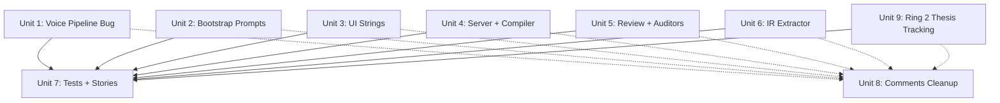

# refactor: Fiction-to-essay adaptation phase 2

## Overview

Phase 1 (PR #5) adapted ~85% of user-facing text. This plan covers the remaining ~15%: 56 P0 findings across LLM prompts and UI strings, a functional bug in the voice pipeline, Ring 2 repurposing for essay thesis/argument tracking, and IR extractor reframing for essay concepts. The goal is to reach ~98% adaptation — everything a user or LLM touches uses essay terminology, and Ring 2 actively supports multi-section essay coherence.

## Problem Frame

A deep 8-agent audit reading every file in the codebase found 128 remaining fiction references and 8 functional gaps. The most critical finding is a hardcoded `"fiction"` domain string in `server/profile/projectGuide.ts:33` that actively degrades voice quality for essay projects. Beyond string fixes, three subsystems need functional repurposing: the IR extractor (extracts fiction concepts), Ring 2 (hollow for essays), and the auditor suite (tracks character knowledge and literary subtext instead of argument coherence).

(see origin: `docs/brainstorms/2026-04-08-essay-writer-adaptation-requirements.md`)

## Requirements Trace

- R5. Anti-ablation guardrails rewritten for essays — immune sections still leak fiction content
- R6. Bootstrap prompt produces essay-appropriate section plans — sceneBootstrap.ts has 16 remaining fiction strings in LLM prompts
- R7. Generation instruction uses essay context — compiler helpers/ring2/ring3 have fiction framing
- R8. Section plans work naturally for essays — subtext and character concepts still injected
- R9. Author persona as single "character" — UI still says "character" in several places
- R15. Data model not modified — maintained (string changes only)
- R16. Ring builder logic not modified — maintained (content changes only)

## Scope Boundaries

- **No TypeScript interface changes** — adaptation is prompt-level and string-level only
- **No SQLite schema changes** — JSON blob storage means field changes are free
- **No compilation pipeline logic changes** — only content/strings within the pipeline
- **Ring 2 repurposing is string-level** — reframe output labels for thesis/argument tracking, no builder logic changes
- **Auditor functional repurposing is Phase 2** — string fixes come first
- **No new features** — this is adaptation, not feature work (research/citation integration deferred)

## Context & Research

### Relevant Code and Patterns

- PR #5 established the adaptation pattern: change string literals and prompt text only, never touch interfaces, types, or builder logic
- `src/app/components/field-glossary.ts` is the gold standard — all 44 entries fully adapted with essay terminology
- `src/bootstrap/profileExtractor.ts` shows the profile extraction pattern: map essay concepts to fiction field names internally
- Fill-blank merge strategy: auto-generated data never overwrites user-set values

### Institutional Learnings

- **Immune sections are the most dangerous domain leak vector** — they bypass compilation and appear in every prompt. Audit immune sections first. (from `docs/solutions/domain-adaptation/fiction-to-essay-prompt-rewrite.md`)
- **Budget enforcer interaction**: Ring 1 hard cap was 2000 but builder bumps internally. When modifying Ring 1/2 content, verify sections survive compression. (same source)
- **Factory function pattern**: When `createEmptyScenePlan()` adds required fields, grep all callers. Any caller that doesn't set the new field is a bug. (from `docs/solutions/logic-errors/bootstrap-gate-empty-failure-mode-2026-04-10.md`)
- **Prompt snapshot testing**: grep compiled output for forbidden fiction terms as regression guard.

## Key Technical Decisions

- **Fix the domain bug first**: `server/profile/projectGuide.ts:33` hardcodes `"fiction"` as the writing sample domain, actively degrading voice pipeline quality for essays. This is the highest-priority fix.
- **Subtext removal strategy**: Rather than repurposing subtext (surface vs. actual conversation) for essays, remove subtext injection from the prompt when data is empty. The nullable field design already supports this — if `subtext` fields are null, the section is simply not generated. Add a comment noting the fiction-only purpose.
- **Ring 2 is functional, not hollow**: Ring 2 already works when ChapterArc data is populated — the bootstrap UI defaults to `includeChapterArc: true`. The fields map naturally: `workingTitle` = essay title, `narrativeFunction` = thesis/argument, `dominantRegister` = tone, `pacingTarget` = pacing, `endingPosture` = conclusion. The reader state fields (knows/suspects/wrongAbout/activeTensions) map to argument state per R10. The adaptation is string-level: reframe output labels to emphasize thesis tracking and argument progression. No builder logic changes needed (R16 maintained). A dedicated Unit 9 handles this.
- **Auditor adaptation is prompt-only**: epistemic.ts and subtext.ts have fiction-specific prompts but domain-agnostic checking logic. Change the prompts to essay concepts (fact consistency, tonal integrity). The checking algorithms stay unchanged per R18.
- **IR extractor reframing**: Change the extraction prompt from fiction concepts (withheld facts, suspicions, character positions) to essay concepts (claims made, evidence cited, arguments advanced). The IR data structure stays unchanged — only what the LLM extracts changes.
- **Comments as lowest priority**: ~31 P2 comment findings are real but low impact. Group into a single cleanup unit at the end.

## Open Questions

### Resolved During Planning

- **Should Ring 2 be repurposed in this plan?** Yes — Ring 2 is already functional when ChapterArc data is populated (bootstrap UI defaults to `includeChapterArc: true`). The existing fields map to essay concepts (R10). A dedicated Unit 9 reframes all Ring 2 output labels for thesis/argument tracking without changing builder logic (R16 maintained).
- **Should simulator be adapted?** The reader epistemic state module (`src/simulator/readerState.ts`) is functionally dead for essays. Leave it dormant — it won't fire without IR data. Clean up comments only.
- **Should voiceSeparability be adapted?** It measures multi-character dialogue voice — irrelevant for single-author essays. Leave dormant, clean up comments only.

### Deferred to Implementation

- **Exact essay framing for IR extraction fields**: The IR extractor needs `factsWithheld` → claims not yet supported, `suspicionGained` → where argument is heading, `unresolvedTensions` → open questions. Exact wording should be determined by reading the full extractor prompt in context.
- **Auditor prompt specifics**: The exact essay-appropriate prompts for epistemic.ts (fact consistency) and subtext.ts (tonal integrity) should be drafted during implementation after reading the full auditor code.

## Implementation Units

Units 1-6 and 9 are independent and run in parallel. Unit 7 (tests) depends on all source changes landing first. Unit 8 (comments + logs) runs **after** Units 1-6 and 9 complete — it shares files with Units 1, 4, and 5 (`projectGuide.ts`, `routes.ts`, `epistemic.ts`, `subtext.ts`), so it cannot run in parallel with those units. Unit 8 can run in parallel with Unit 7.

---

- [ ] **Unit 1: Fix voice pipeline domain bug + project guide prompts**

**Goal:** Fix the hardcoded `"fiction"` domain string that actively degrades voice quality, and adapt all LLM prompts in the voice pipeline's project guide.

**Requirements:** R5 (anti-ablation guardrails), R17 (voice pipeline logic unchanged — prompt content only)

**Dependencies:** None

**Files:**
- Modify: `server/profile/projectGuide.ts`
- Test: `tests/server/db/profile-repos.test.ts`, `tests/profile/chunker.test.ts`, `tests/profile/types.test.ts`

**Approach:**
- Line 33: Change `"fiction"` → `"essay"` in `createWritingSample()` call
- Lines 92-110: Replace all "scene"/"scenes" with "section"/"sections" in LLM synthesis prompts
- Line 160: Change `"from N completed scenes, in-domain"` → `"from N completed sections, in-domain"`
- Line 189: Change `"in-domain evidence from their fiction"` → `"in-domain evidence from their essays"`
- Lines 14-19: Update JSDoc from "fiction project" to "essay project"
- Update test files that assert on `"fiction"` domain string

**Patterns to follow:**
- `src/bootstrap/profileExtractor.ts` — already adapted, shows the pattern for voice-related prompt changes

**Test scenarios:**
- Happy path: `createWritingSample()` creates sample with domain `"essay"` instead of `"fiction"`
- Happy path: Synthesis prompt contains "sections" not "scenes"
- Happy path: distillVoice prompt references "essays" not "fiction"
- Edge case: Existing projects with `"fiction"` domain samples still work (the domain field is informational, not a filter)

**Verification:**
- `grep -r '"fiction"' server/profile/` returns zero matches
- `grep -r '"fiction"' tests/profile/` returns zero matches
- `pnpm test` passes

---

- [ ] **Unit 2: sceneBootstrap.ts deep prompt adaptation**

**Goal:** Fix all 16 remaining fiction strings in the bootstrap LLM prompts — the text that tells the LLM how to generate section plans.

**Requirements:** R6 (bootstrap prompt for essays), R8 (section plans work for essays)

**Dependencies:** None

**Files:**
- Modify: `src/bootstrap/sceneBootstrap.ts`
- Test: `tests/bootstrap/sceneBootstrap.test.ts`

**Approach:**
- Line 479: `"CHAPTER DIRECTION:"` → `"ESSAY DIRECTION:"`
- Line 482: `"scene plan"` → `"section plan"` (already identified pre-audit)
- Line 488: `"Scene title"` → `"Section title"` in JSON template
- Line 497: Reframe sensory notes guidance from fiction ("reveal character state", "dramatic purpose") to essay ("ground the reader", "establish atmosphere for the argument")
- Lines 515-519: Remove subtext block from JSON template (or make conditional — if subtext data is null, don't include the schema field). For essays, subtext (surface vs. actual conversation) is not applicable.
- Line 520: `"presentCharacterIds"` prompt text — reframe as `"voiceProfileIds"` in the prompt description (the field name stays)
- Line 521: `"sceneSpecificProhibitions"` → describe as `"sectionSpecificProhibitions"` in prompt
- Lines 527-537: `"chapterArc"` descriptions — change `"chapter"` → `"essay"`, `"larger story"` → `"larger essay"`
- Line 542: `"scenes"` → `"sections"` in continuity instructions
- Lines 432-438: `"scene"` → `"section"` in continuation context
- Line 291: `"POV:"` in condensed output — reframe for essays
- Line 387: `"ESTABLISHED CHAPTER ARC:"` → `"ESTABLISHED ESSAY ARC:"` in buildContextBlocks
- Lines 393-398: `"EXISTING SCENES"` → `"EXISTING SECTIONS"`, `"CHARACTER DOSSIERS"` → `"VOICE PROFILES"` in context block headers
- Line 366: `"SCENE ENDING POLICY:"` → `"SECTION ENDING POLICY:"`

**Patterns to follow:**
- Lines 417-418 in the same file — already adapted to "essay structure planner", follow this pattern
- `src/bootstrap/index.ts` — fully adapted bootstrap prompt, shows essay framing

**Test scenarios:**
- Happy path: `buildSceneBootstrapPrompt()` output contains "section plan" not "scene plan"
- Happy path: Prompt contains "ESSAY DIRECTION:" not "CHAPTER DIRECTION:"
- Happy path: Prompt contains "EXISTING SECTIONS" not "EXISTING SCENES"
- Happy path: Prompt contains "VOICE PROFILES" not "CHARACTER DOSSIERS"
- Edge case: Single section generation uses "section plan" (singular)
- Edge case: Multi-section generation uses "section plans" (plural)
- Integration: Bootstrap with empty characters array produces no subtext block in prompt

**Verification:**
- `grep -i "chapter direction\|scene plan\|existing scenes\|character dossiers" src/bootstrap/sceneBootstrap.ts` returns zero matches (excluding interface names)
- `pnpm test` passes
- Test assertions updated to match new prompt text

---

- [ ] **Unit 3: UI strings — error messages, labels, and component text**

**Goal:** Fix 19 remaining P0 user-visible strings across UI components and store.

**Requirements:** R9 (author persona representation)

**Dependencies:** None

**Files:**
- Modify: `src/app/store/generation.svelte.ts`
- Modify: `src/app/components/CompilerView.svelte`
- Modify: `src/app/components/AtlasJsonTab.svelte`
- Modify: `src/app/components/AtlasBibleTab.svelte`
- Modify: `src/app/components/AtlasSceneTab.svelte`
- Modify: `src/app/components/stages/DraftStage.svelte`
- Test: `tests/ui/CompilerView.test.ts` (if exists), `tests/store/generation.test.ts` (if exists)

**Approach:**
- `generation.svelte.ts`: 6 error messages — replace "bible" → "brief", "scene plan" → "section plan" at lines 107, 143, 174, 245, 321, 347
- `CompilerView.svelte:49`: `"Load a Bible and Scene Plan"` → `"Load a brief and section plan"`
- `AtlasJsonTab.svelte`: 6 strings — `"Invalid Bible JSON"` → `"Invalid brief JSON"`, `"Load Bible"` → `"Load Brief"`, `"Save Bible"` → `"Save Brief"`, `"Bible / Scene / Arc tabs"` → `"Brief / Section / Arc tabs"`, `"Bible edits"` → `"Brief edits"`, `"Bible JSON"` → `"Brief JSON"`
- `AtlasBibleTab.svelte:124`: `"New Character"` → `"New Voice"`
- `AtlasBibleTab.svelte:232`: `"Edit character"` → `"Edit voice profile"`
- `AtlasBibleTab.svelte:267`: `"No characters or locations"` → `"No voices or references"`
- `AtlasSceneTab.svelte:89`: `"Select character..."` → `"Select voice..."`
- `AtlasSceneTab.svelte:245,133`: `"Narrative Goal"` → `"Section Goal"`
- `DraftStage.svelte:336`: `"No bible loaded."` → `"No brief loaded."`

**Patterns to follow:**
- `src/app/components/field-glossary.ts` — fully adapted, shows essay terminology conventions
- `src/app/components/AtlasPane.svelte` — already adapted tab labels ("Brief" not "Bible")

**Test scenarios:**
- Happy path: CompilerView shows "Load a brief and section plan" when no data loaded
- Happy path: AtlasJsonTab buttons read "Load Brief" and "Save Brief"
- Happy path: Generation error messages use "brief" and "section plan"
- Happy path: AtlasBibleTab creates new entries labeled "New Voice" not "New Character"
- Happy path: AtlasSceneTab label reads "Section Goal" not "Narrative Goal"

**Verification:**
- `grep -ri "bible\|scene plan" src/app/store/generation.svelte.ts` returns zero matches (excluding variable names)
- `grep -ri '".*bible.*"' src/app/components/AtlasJsonTab.svelte` returns zero matches for user-visible strings
- `pnpm test` passes

---

- [ ] **Unit 4: Server API errors + compiler prompt strings + export + gates**

**Goal:** Fix 5 API error messages, compiler prompt strings (helpers, ring3), export fallbacks, and gate message. Ring 2 changes are handled in dedicated Unit 9.

**Requirements:** R7 (generation instruction uses essay context)

**Dependencies:** None

**Files:**
- Modify: `server/api/routes.ts`
- Modify: `src/compiler/helpers.ts`
- Modify: `src/compiler/ring3.ts`
- Modify: `src/export/markdown.ts`
- Modify: `src/export/plaintext.ts`
- Modify: `src/gates/index.ts`
- Modify: `src/bible/versioning.ts`
- Test: `tests/compiler/helpers.test.ts`, `tests/compiler/ring3.test.ts`, `tests/export/markdown.test.ts`, `tests/gates/gates.test.ts`

**Approach:**

*Server API (routes.ts):*
- Line 93: `"No bible found"` → `"No essay brief found"`
- Line 101: `"Bible version not found"` → `"Essay brief version not found"`
- Line 129: `"Chapter arc not found"` → `"Essay arc not found"`
- Line 159: `"Scene plan not found"` → `"Section plan not found"`
- Line 184: `"Scene not found"` → `"Section not found"`
- Section comments: `"--- Bibles ---"` → `"--- Essay Briefs ---"`, etc.

*Compiler helpers (helpers.ts):*
- Line 6: `"=== SCENE:"` → `"=== SECTION:"`
- Lines 13-19: `"SUBTEXT CONTRACT:"` section — already conditional on `plan.subtext` being truthy (line 13: `if (plan.subtext)`). No conditionalization needed. Rename the header from `"SUBTEXT CONTRACT:"` to `"IMPLICIT MEANING CONTRACT:"` or similar, and add comment: `// Subtext contract is fiction-specific; essays typically skip this section via null data`
- Lines 41-45: `"CHARACTER KNOWLEDGE CHANGES:"` — already conditional on non-empty data (line 41: `if (Object.keys(...).length > 0)`). No conditionalization needed. Rename header and add comment: `// Character knowledge tracking is fiction-specific; essays skip via empty data`
- Line 100: `"In this scene:"` → `"In this section:"`
- Lines 206-208: `"Scene-specific bans:"` → `"Section-specific bans:"`
- Line 143: `"Contradictions (show through action, never state directly):"` — this is fiction advice about showing character contradictions through physical action. Reframe to `"Contradictions (demonstrate through evidence and reasoning, not assertion):"`

*Compiler ring3 (ring3.ts):*
- Line 64: `"previous scene"` → `"previous section"`

*Export:*
- `markdown.ts:32`: `"Scene ${i + 1}"` → `"Section ${i + 1}"`
- `plaintext.ts`: Update comment

*Gates:*
- `index.ts:102`: `"Bible version ${...} is outdated"` → `"Brief version ${...} is outdated"`

*Bible versioning:*
- `versioning.ts:65`: `'Character "${c.name}"'` → `'Voice profile "${c.name}"'`
- `versioning.ts:76`: `'Location "${l.name}"'` — keep as-is (locations exist in the data model, just unused for essays)

**Patterns to follow:**
- `src/compiler/ring1.ts` — already adapted in PR #5
- `src/compiler/assembler.ts` — already adapted

**Test scenarios:**
- Happy path: API returns "Section plan not found" not "Scene plan not found" for missing plan
- Happy path: Compiled payload section header reads "=== SECTION:" not "=== SCENE:"
- Happy path: Exported markdown uses "Section 1" not "Scene 1" as fallback heading
- Happy path: Gate message says "Brief version" not "Bible version"
- Edge case: helpers.ts with null subtext produces no SUBTEXT CONTRACT section

**Verification:**
- `grep -i '".*scene.*"' src/compiler/helpers.ts` returns zero matches for string literals (excluding variable names)
- `grep -i 'bible' src/gates/index.ts` returns zero matches in user-facing strings
- `pnpm test` passes

---

- [ ] **Unit 5: Review + auditor + learner prompt adaptation**

**Goal:** Fix review prompts, auditor LLM prompts, and learner user-facing proposal strings.

**Requirements:** R5 (anti-ablation guardrails), R18 (auditor checking logic unchanged — prompts only)

**Dependencies:** None

**Files:**
- Modify: `src/review/prompt.ts`
- Modify: `src/auditor/subtext.ts`
- Modify: `src/auditor/epistemic.ts`
- Modify: `src/learner/patterns.ts`
- Modify: `src/learner/proposals.ts`
- Modify: `src/linter/index.ts`
- Test: `tests/auditor/subtext.test.ts`, `tests/auditor/epistemic.test.ts`, `tests/learner/patterns.test.ts`, `tests/learner/proposals.test.ts`, `tests/linter/linter.test.ts`

**Approach:**

*Review prompts (prompt.ts):*
- Line 59: `"bible"` → `"essay brief"` in severity definitions
- Line 60: `"narrative coherence"` → `"argumentative coherence"`
- Line 68: `"narration"` → `"prose"` in scope definition

*Auditor subtext (subtext.ts):*
- Line 48: `"literary editor specializing in subtext"` → `"editorial reviewer specializing in nuance and implication"`. Reframe: instead of checking whether "characters explicitly state emotional truths", check whether "the author explicitly states what the reader should feel rather than letting evidence speak"
- Line 71: `"character or narrator"` → `"the author"`
- Lines 3-4: Update module comment

*Auditor epistemic (epistemic.ts):*
- Lines 3-4: Update module comment from "character knowledge" to "factual consistency"
- Note: This file is a **deterministic checker** (set-intersection on IR data), NOT an LLM-based auditor. There is no LLM prompt to reframe. The only user-facing string is the error message at line 63: `${charName} appears to know "${learned}" but no source was found` — reframe to `"${voiceName} references "${learned}" but no prior section established this"`

*Learner patterns (patterns.ts):*
- Line 323: `"scenes"` → `"sections"` in proposal description
- Line 354: `"voice guidance in your bible"` → `"voice guidance in your essay brief"`
- Line 359: `"character voice definitions"` → `"author voice definitions"`
- Lines 302-303: `"characters.voiceNotes"`, `"characters.emotionPhysicality"`, `"locations.sensoryPalette"` — these map proposal targets to Bible fields. For essays, the same fields exist but the target descriptions should read `"voice profile notes"`, `"writing energy"`, `"reference atmosphere"` in the user-facing proposal text

*Learner proposals (proposals.ts):*
- Line 227: `"scenes"` → `"sections"`, `"bible or style guide"` → `"essay brief or style guide"`

*Linter (index.ts):*
- Line 87: `MISSING_SUBTEXT` message — change to essay-appropriate: `"Multi-voice section has no implicit meaning contract"` → `"Section lacks tonal direction. Consider adding tone or register guidance."`

**Patterns to follow:**
- `src/review/refine.ts` — already adapted to "essays and nonfiction"
- `src/auditor/killList.ts` — domain-agnostic, no changes needed

**Test scenarios:**
- Happy path: Review prompt severity definition mentions "essay brief" not "bible"
- Happy path: Subtext auditor prompt asks about "the author" not "characters"
- Happy path: Epistemic auditor checks "factual consistency" not "character knowledge"
- Happy path: Learner proposal descriptions use "sections" not "scenes"
- Happy path: Linter MISSING_SUBTEXT message uses essay framing
- Edge case: Auditor with no section data (empty IR) returns no findings gracefully

**Verification:**
- `grep -i "bible\|character.*voice\|narrative coherence" src/review/prompt.ts` returns zero matches in prompt strings
- `grep -i "literary editor\|character or narrator" src/auditor/subtext.ts` returns zero matches
- `pnpm test` passes

---

- [ ] **Unit 6: IR extractor essay adaptation**

**Goal:** Reframe the IR extraction prompt from fiction concepts to essay concepts.

**Requirements:** R7 (essay context in generation)

**Dependencies:** None

**Files:**
- Modify: `src/ir/extractor.ts`
- Test: `tests/ir/extractor.test.ts`

**Approach:**
- Line 80: `"narrative structure analyst"` → `"essay structure analyst"`
- Line 51: `"narrative internal record"` → `"structural record"` or `"essay internal record"`
- Lines 52-74: Reframe extraction fields:
  - `factsRevealed` → "claims established" or "points made"
  - `factsWithheld` → "claims not yet supported" or "evidence gaps"
  - `suspicionGained` → "where the argument is heading"
  - `unresolvedTensions` → "open questions or unresolved counterarguments"
  - `characterPositions` → "author's stated positions" or remove
  - The JSON schema field *names* stay unchanged (they're part of the TypeScript interface)
  - Only the *descriptions* in the LLM prompt change

**Execution note:** Read the full extractor.ts prompt in context before drafting replacements. The exact wording should feel natural for essay analysis, not forced.

**Patterns to follow:**
- The IR parser (`src/ir/parser.ts`) is already clean — domain-agnostic parsing
- `src/bootstrap/index.ts` — shows how essay-specific prompt framing works

**Test scenarios:**
- Happy path: Extraction prompt contains "essay structure analyst" not "narrative structure analyst"
- Happy path: Prompt describes `factsRevealed` as "claims established" not fiction equivalent
- Happy path: Prompt describes `unresolvedTensions` as "open questions" not "dramatic tensions"
- Edge case: Extraction with empty section prose returns empty IR gracefully
- Integration: Full extraction → parse cycle produces valid IR with essay-appropriate field descriptions

**Verification:**
- `grep -i "narrative.*analyst\|story world\|character.*position" src/ir/extractor.ts` returns zero matches in prompt strings
- `pnpm test` passes

---

- [ ] **Unit 9: Ring 2 essay thesis tracking repurposing**

**Goal:** Reframe Ring 2 from fiction chapter tracking to essay thesis/argument tracking. All existing data structures work for essays — the fields map naturally (R10). This unit changes output strings only; builder logic stays unchanged (R16).

**Requirements:** R7 (essay context in generation), R10 (reader state tracks argument progression), R16 (Ring builder logic unchanged)

**Dependencies:** None (parallel with Units 1-6)

**Files:**
- Modify: `src/compiler/ring2.ts`
- Test: `tests/compiler/ring2.test.ts`

**Approach:**

*Ring 2 section output reframing (ring2.ts):*

`buildChapterBriefSection` (line 46-66):
- Line 47: `"Chapter ${chapterArc.chapterNumber}: ${chapterArc.workingTitle}"` → `"${chapterArc.workingTitle}"`
- Line 49: `"Function:"` → `"Thesis:"` — the `narrativeFunction` field carries the essay's central argument
- Line 62: `"=== CHAPTER CONTEXT ==="` → `"=== ESSAY THESIS & STRUCTURE ==="`
- Section name stays `"CHAPTER_BRIEF"` (internal, not user-facing)

`buildReaderStateSection` (line 68-82):
- Line 78: `"READER STATE AT CHAPTER START:"` → `"ARGUMENT STATE ENTERING THIS SECTION:"`
- Line 71: `"Knows:"` → `"Established:"` (premises the reader accepts)
- Line 72: `"Suspects:"` → `"Expects:"` (where the reader thinks the argument is heading)
- Line 73: `"Wrong about:"` → `"Assumptions challenged:"` (beliefs the essay contests)
- Line 74: `"Tensions:"` → `"Open questions:"` (unresolved threads)

`buildActiveSetupsSection` (line 84-93):
- Line 89: `"ACTIVE SETUPS:"` → `"ACTIVE ARGUMENT THREADS:"`

`buildCharacterStateSections` (line 95-133):
- Line 126: `"CHARACTER STATE — ${name} (entering this scene):"` → `"VOICE STATE — ${name} (entering this section):"`
- Line 17: `"Knows:"` → `"Established:"` in character state builder
- Line 24: `"Suspects:"` → `"Building toward:"`
- Line 33: `"Emotional state:"` → `"Tonal register:"`
- Line 37: `"Relationships:"` → `"Rhetorical stance:"`

`buildUnresolvedTensionsSection` (line 135-143):
- Line 139: `"UNRESOLVED TENSIONS ENTERING THIS SCENE:"` → `"OPEN QUESTIONS ENTERING THIS SECTION:"`

**Essay-to-fiction field mapping reference** (for implementer context):
| Fiction concept | Essay concept | Data field |
|---|---|---|
| Chapter title | Essay title | `chapterArc.workingTitle` |
| Narrative function | Thesis/central argument | `chapterArc.narrativeFunction` |
| Dominant register | Tone/register | `chapterArc.dominantRegister` |
| Pacing target | Argument pacing | `chapterArc.pacingTarget` |
| Ending posture | Conclusion approach | `chapterArc.endingPosture` |
| Reader knows | Established premises | `readerState.knows` |
| Reader suspects | Reader expectations | `readerState.suspects` |
| Reader wrong about | Challenged assumptions | `readerState.wrongAbout` |
| Active tensions | Open questions | `readerState.activeTensions` |
| Active setups | Argument threads | `bible.narrativeRules.setups` |
| Character state | Author voice state | `characterDeltas` |
| Unresolved tensions (IR) | Open questions (IR) | `lastIR.unresolvedTensions` |

**Patterns to follow:**
- `src/compiler/ring1.ts` — already adapted with essay terminology
- `src/compiler/assembler.ts` — already adapted, shows ring2 is only built when ChapterArc provided

**Test scenarios:**
- Happy path: `buildChapterBriefSection()` outputs "ESSAY THESIS & STRUCTURE" with "Thesis:" label
- Happy path: `buildReaderStateSection()` outputs "ARGUMENT STATE ENTERING THIS SECTION" with "Established:" and "Expects:"
- Happy path: `buildUnresolvedTensionsSection()` outputs "OPEN QUESTIONS ENTERING THIS SECTION"
- Happy path: `buildCharacterStateSections()` outputs "VOICE STATE" with "Tonal register:" instead of "Emotional state:"
- Happy path: `buildActiveSetupsSection()` outputs "ACTIVE ARGUMENT THREADS"
- Edge case: Empty ChapterArc fields produce minimal output (just title)
- Edge case: No character deltas → no voice state sections generated
- Edge case: Empty reader state → no argument state section
- Integration: Full `buildRing2()` with essay-populated ChapterArc + IR data produces coherent essay context

**Verification:**
- `grep -i "chapter\|character state\|unresolved tensions" src/compiler/ring2.ts` returns zero matches in output strings (only variable/type names remain)
- `pnpm test` passes

---

- [ ] **Unit 7: Test mock data + Storybook factories**

**Goal:** Update all fiction-oriented mock data in tests and Storybook stories to use essay scenarios.

**Requirements:** Test suite reflects essay tool identity

**Dependencies:** Units 1-6 (source code changes must land first so test assertions match)

**Files:**
- Modify: `tests/helpers/factories.ts`
- Modify: `src/app/stories/factories.ts`
- Modify: `tests/store/startup.test.ts`
- Modify: `tests/ui/ProjectList.test.ts`
- Modify: `tests/api/client.test.ts`
- Modify: `tests/server/routes/projects.test.ts`
- Modify: `tests/ui/BootstrapModal.test.ts`
- Modify: `tests/integration/chapter-workflow.test.ts`
- Modify: `tests/profile/renderer.test.ts`
- Modify: `tests/bootstrap/sceneBootstrap.test.ts`
- Modify: Multiple Storybook story files in `src/app/stories/`

**Approach:**

*Project titles:*
- All mock project titles `"Novel"`, `"My Novel"`, `"Test Novel"`, `"Second Novel"` → `"Essay"`, `"My Essay"`, `"Test Essay"`, `"Second Essay"`

*Domain strings:*
- `tests/server/db/profile-repos.test.ts`: `"fiction"` → `"essay"`
- `tests/profile/chunker.test.ts`: `"fiction"` → `"essay"`
- `tests/profile/types.test.ts`: `"fiction"` → `"essay"`

*Test factories (tests/helpers/factories.ts):*
- Line 39: `"Chapter One"` → `"Section One"`
- Line 40: `"Establish world"` → `"Establish thesis"`

*Storybook factories (src/app/stories/factories.ts):*
- `makeScenePlan`: Replace "The Confrontation" Alice/Bob scenario with essay scenario (e.g., "The Cost of Remote Work" with section goals about arguing the thesis)
- `makeNarrativeIR`: Replace fiction events with essay claims/evidence
- `makeVoiceReport`: Replace fiction character names with author voice names
- `makeChapterArc`: Replace fiction plot with essay arc
- `makeCharacterDelta`: Replace fiction with essay terminology

*BootstrapModal.test.ts:*
- Replace `"A noir detective story."` with `"Why remote work fails at scale."`
- Replace `"A detective in a jazz bar."` with `"The hidden costs of always-on culture."`

*chapter-workflow.test.ts:*
- Replace schoolteacher murder mystery mock data with essay scenario

*sceneBootstrap.test.ts:*
- Update test assertions to match Unit 2's prompt changes (e.g., `"section plan"` not `"scene plan"`)
- Update fiction character names in mock data to essay voice profiles
- Note: Heavy fiction scenario data (Marcus Cole, Elena Voss) should be replaced with essay-appropriate mock data (author voice profiles)

*Storybook stories:*
- Replace fiction scene titles ("The Arrival", "The Confrontation", "The Revelation") with essay section titles across all story files

*renderer.test.ts:*
- Line 62: `"journalism metaphors won't work in fiction"` → `"journalism metaphors won't work in essays"`

**Patterns to follow:**
- `src/app/components/field-examples.ts` — already uses essay scenarios (personal essays, op-eds, AI slop words)
- `tests/bootstrap/bootstrap.test.ts` — already adapted

**Test scenarios:**
- Happy path: All tests pass with essay-oriented mock data
- Happy path: Storybook stories render correctly with essay scenarios
- Edge case: Factory functions produce valid data matching TypeScript interfaces

**Verification:**
- `grep -ri '"novel"' tests/` returns zero matches in mock data
- `grep -ri '"fiction"' tests/` returns zero matches in domain strings
- `grep -ri "detective\|murder\|thriller\|noir" tests/ src/app/stories/` returns zero matches
- `pnpm test` passes
- `pnpm storybook` builds without errors

---

- [ ] **Unit 8: Code comments + log messages cleanup**

**Goal:** Fix ~31 P2 code comments and ~19 P3 log messages with fiction terminology.

**Requirements:** Maintainability — code should read as an essay tool to new contributors

**Dependencies:** None (can run in parallel with Unit 7)

**Files:**
- Modify: `src/simulator/readerState.ts` (comments)
- Modify: `src/metrics/styleDrift.ts` (comment)
- Modify: `src/metrics/voiceSeparability.ts` (comments)
- Modify: `src/export/markdown.ts` (comment)
- Modify: `src/export/plaintext.ts` (comment)
- Modify: `server/api/routes.ts` (comments, log messages)
- Modify: `server/profile/projectGuide.ts` (comments, JSDoc, log messages)
- Modify: `server/db/schema.ts` (comment)
- Modify: `src/auditor/epistemic.ts` (comment — if not already handled in Unit 5)
- Modify: `src/auditor/subtext.ts` (comment — if not already handled in Unit 5)

**Approach:**
- Replace "scene" → "section", "chapter" → "essay", "character" → "voice"/"author voice", "bible" → "essay brief" in all code comments, JSDoc, and log messages
- Do NOT change variable names, function names, or interface names
- Log messages are cosmetic but help maintainer comprehension

**Test expectation:** None — pure comment and log changes have no behavioral impact.

**Verification:**
- `pnpm test` passes (no behavioral changes)
- Spot-check: `grep -n "scene\|chapter\|bible\|character" src/simulator/readerState.ts` — only variable names remain, not comments

---

## System-Wide Impact

- **Interaction graph:** Units 1-6 change prompt strings that flow through the compilation pipeline → LLM API. Changes are content-only; no control flow changes.
- **Error propagation:** API error messages (Unit 4) surface through `src/api/client.ts` to UI. No new error types or paths added.
- **State lifecycle risks:** None — all changes are string-level. No data migration, no schema changes.
- **API surface parity:** API endpoints return different error message text but identical status codes and response shapes.
- **Integration coverage:** The compilation pipeline should be tested end-to-end after all units land to verify no fiction strings leak into compiled payloads. Use the prompt snapshot testing approach from the learnings.
- **Unchanged invariants:** TypeScript interfaces (Bible, ScenePlan, CharacterDossier), SQLite schema, Ring builder logic, voice pipeline stages, auditor checking algorithms — all unchanged.

## Risks & Dependencies

| Risk | Mitigation |
|------|------------|
| Test assertions break after source string changes | Unit 7 explicitly depends on Units 1-6 and updates all assertions |
| Subtext/character knowledge sections still injected for essays | Make conditional on data presence in helpers.ts — nullable fields mean empty data = no section |
| Ring 2 essay reframing changes compiled output semantics | Ring 2 output is only built when ChapterArc is provided. String changes are content-only; builder logic unchanged. Existing tests verify section structure. |
| Budget enforcer interaction with changed Ring 1/2 content | Verify immune sections survive compression (learnings insight) |
| Storybook story renames break story file references | Check for dynamic imports or story ID references before renaming |

## Future Work (Not in This Plan)

1. **Essay-specific auditors** — New auditors for argument coherence, transition quality, repetition detection, evidence density. Requires new auditor modules.
2. **Research/citation integration** — Sources panel, citation injection into Ring 3. New feature.
3. **Thesis refinement loop** — Post-draft analysis of whether output argues what thesis claims.
4. **Additional genre templates** — Explainer, Review/Criticism, Technical Essay.
5. **Model upgrades** — R14a-d from requirements doc (pipeline model defaults).

## Post-Landing Cleanup

After all units land, update `CLAUDE.md`'s "Adapted" and "Not yet adapted" lists to reflect current state. Items already adapted (field-glossary.ts, field-examples.ts, App.svelte, ring1.ts, refine.ts) should move to the Adapted list. Items fixed by this plan should also move. The Adaptation Status section is the authoritative reference for contributors.

## Sources & References

- **Origin document:** [docs/brainstorms/2026-04-08-essay-writer-adaptation-requirements.md](docs/brainstorms/2026-04-08-essay-writer-adaptation-requirements.md)
- **Previous plan:** [docs/plans/2026-04-10-002-refactor-fiction-to-essay-deep-adaptation-plan.md](docs/plans/2026-04-10-002-refactor-fiction-to-essay-deep-adaptation-plan.md)
- **Learnings:** [docs/solutions/domain-adaptation/fiction-to-essay-prompt-rewrite.md](docs/solutions/domain-adaptation/fiction-to-essay-prompt-rewrite.md)
- **Learnings:** [docs/solutions/logic-errors/bootstrap-gate-empty-failure-mode-2026-04-10.md](docs/solutions/logic-errors/bootstrap-gate-empty-failure-mode-2026-04-10.md)
- Related PR: #5 (56-file deep adaptation)
