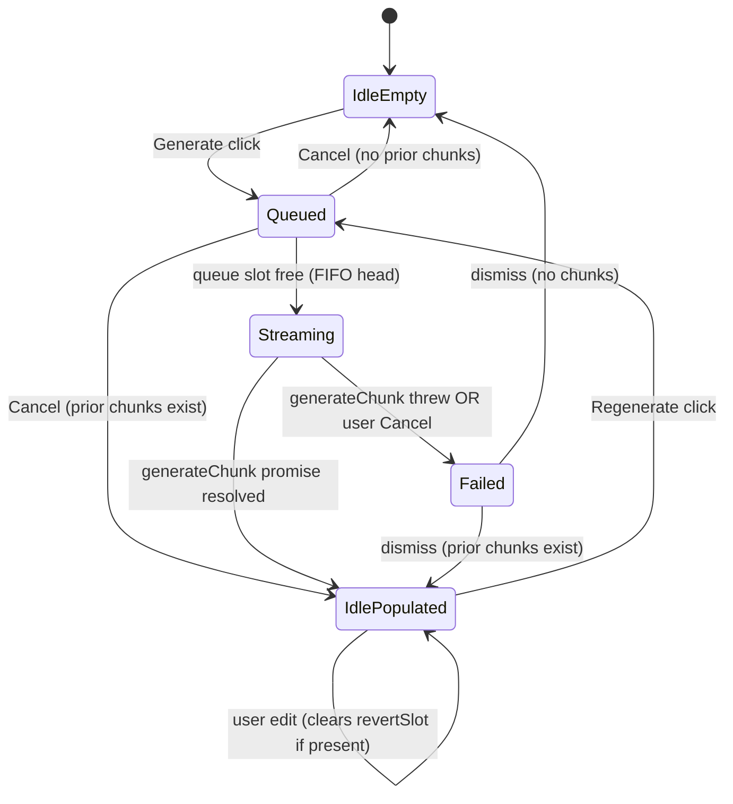

# Essay Composer Single-Page UI

## Overview

Replace the 7-stage fiction workflow with a single-page `EssayComposer` view for essay projects, leaving fiction projects on the existing rail unchanged. The new composer is one scrollable page containing a collapsible Setup panel (Brief/Voice/Style), a vertical list of section cards with inline generation and editing, and a status footer. Routing diverges at the top of `App.svelte` based on a new `bible.mode: "fiction" | "essay"` field. Fiction mode is preserved as the default for every existing project and for any Bible where `mode` is undefined.

The change is intentionally additive: no existing fiction component is deleted, no existing test breaks, and the compilation pipeline, voice pipeline, CIPHER, revision learner, and auditor all function with zero modifications. The composer is a new component tree that calls into the existing store, commands, and generation pipeline.

## Problem Frame

Word-compiler was built for long-form fiction — characters, chapter arcs, scene sequencers, IR inspectors, setup/payoff trackers. For 1500-4000 word essays that roughly 80% of the UI is dead weight. A prior pass (2026-04-08 essay adaptation) rewrote prompts and compilation pipeline defaults for essays but left the 7-stage UI intact. The essay-writing experience still requires users to navigate fiction-shaped stages and look at panels irrelevant to their work.

The goal of this plan is to collapse the visible surface into a single-page composer without touching the underlying architecture. See origin: `docs/brainstorms/2026-04-10-essay-composer-ui-simplification-requirements.md`.

## Requirements Trace

All requirement numbers reference the origin document (`2026-04-10-essay-composer-ui-simplification-requirements.md`).

- **R1-R2:** Single scrollable page, three stacked zones (title/export → Setup panel → Sections). Implemented in Unit 8 (EssayComposer root).
- **R3-R6:** Single "Setup" panel with Brief/Voice/Style subsections, reusing existing Bible fields via intentional field reuse. Implemented in Unit 6 (SetupPanel).
- **R7-R12:** Section list with inline editing via AnnotatedEditor, primary controls (heading, goal, key points, anchor lines), up/down reorder buttons, add/delete. Implemented in Unit 5 (SectionCard) and Unit 8 (EssayComposer).
- **R12a-R12e:** Template picker (Opinion + Personal) + bootstrap flow. Implemented in Unit 2 (essayTemplates registry), Unit 3 (template-aware bootstrap), Unit 9 (TemplatePicker).
- **R12k-R12m:** Explicit generation lifecycle states and control matrix. Implemented in Unit 5 (SectionCard state machine) and Unit 8 (EssayComposer queue).
- **R12n-R12o:** Voice profile soft-required with graceful degradation + first-time nudge. Implemented in Unit 5 (section generate) and Unit 8 (composer-level nudge state).
- **R13-R14:** Fiction-specific fields hidden via routing-level branch (composer fully replaces DraftStage when `mode === 'essay'`). Implemented in Unit 10.
- **R15-R15d:** Reuse AnnotatedEditor for inline audit decorations, WCAG-compliant color+style, kill list menu actions ("Ignore", "Remove from kill list"). Implemented in Unit 4 (audit mapping) and Unit 5 (SectionCard).
- **R16:** Status footer with word count, audit counts, voice status, last save. Implemented in Unit 7 (ComposerFooter).
- **R16a-R16d:** Section = ScenePlan row (1:1), chunks invisible in UI. Implemented in Unit 5 (SectionCard).
- **R17-R17c:** `bible.mode` field with `App.svelte` routing branch, default `'fiction'` for legacy projects. Implemented in Unit 1 (mode field) and Unit 10 (routing).
- **R18:** Additive change, no fiction components deleted, no fiction tests broken. Verified in all units.
- **R18a-R18c:** Save-on-blur per section and per Setup field. Implemented in Unit 5 and Unit 6.
- **R18d-R18f:** Export menu (Markdown, plaintext) with empty/unaudited confirmation. Implemented in Unit 7 (ComposerFooter).
- **R18g-R18i:** Keyboard-accessible reorder, color+style audit decoration, 44px touch targets. Implemented in Unit 5.
- **R19:** One new composer component tree reusing existing stores/commands/pipeline. No existing component refactored. Verified in Unit 10.

## Scope Boundaries

- **No SQL migrations.** The `bibles` table stores a JSON blob in the `data` column, so adding `bible.mode` is a TypeScript-only change with zero schema touch.
- **No compilation pipeline changes.** Ring 1/2/3 builders, budget enforcer, assembler all stay unchanged.
- **No voice pipeline changes.** 5-stage pipeline, CIPHER, `distillVoice` all stay unchanged.
- **No auditor core changes.** Kill list / sentence variance / paragraph length checks stay unchanged. A new pure-function mapping layer (`auditMapping.ts`) translates `AuditFlag[]` → `EditorialAnnotation[]` without modifying the auditor.
- **No existing component deleted.** Fiction stage components, panels, modals all remain in the codebase.
- **No home screen redesign.** `ProjectList.svelte` and the "create new project" entry point stay. The create-project click path is rewired to open the TemplatePicker instead of the plain title input, but the project list itself is untouched.
- **No drag-and-drop reorder in V1.** Up/down buttons only.
- **No side-by-side regenerate compare in V1.** Replace-in-place with a 60-second Revert slot.
- **No advanced section controls toggle in V1.** Primary controls (heading, goal, key points, anchor lines) only. Power controls (pacing, density, word count target, reader effect, section prohibitions) are preserved in the data model and can be added as an advanced disclosure in V2.
- **No span-anchored directives in V1.** A single-line micro-directive field per section persists to `humanNotes` on the most recently generated chunk.
- **No 5-template library in V1.** Opinion + Personal only. Three other templates (Explainer, How-to, Hot take) are preserved in the V2 deferred section of the origin doc.
- **No "Rewrite this span" hover action in V1.** Depends on V2 span-directive infrastructure.

## Context & Research

### Relevant Code and Patterns

**Routing anchor (`src/app/App.svelte`, lines 385-435):**
The `stage-workspace` div wraps `{#key workflow.activeStage}<svelte:boundary>` → stage content. This is the exact point to branch on `store.bible?.mode`. The existing header (`app-header`, lines 324-373) stays shared between modes. The model selector at line 348-364 is gated on `workflow.activeStage === "draft"`; its gate must expand to also show in essay mode. `GlossaryPanel` at line 437 is fiction-specific and should be omitted in essay mode.

**Generation pipeline coupling (`src/app/store/generation.svelte.ts`):**
`createGenerationActions(store, commands)` returns `{ generateChunk, runAuditManual, runDeepAudit, extractSceneIR, runAutopilot, requestRefinement }`. `generateChunk(pinnedSceneId?)` at line 105 requires `store.compiledPayload && store.bible && store.activeScenePlan` (the `canGenerate()` check at line 101). It accepts a `pinnedSceneId` but still uses `store.activeScenePlan` via `canGenerate()`. The `setupCompilerEffect(store)` in App.svelte line 33 watches the active scene and recomputes `compiledPayload` automatically. **Composer integration pattern:** before calling `generateChunk(sceneId)`, call `store.setActiveScene(index)` for the target scene, let the compiler effect run, then invoke generation. The abort signal (`store.generationAbortController?.signal`) is already wired.

**AnnotatedEditor interface (`src/app/components/AnnotatedEditor.svelte`, lines 14-30):**
```
{ text: string;
  annotations?: EditorialAnnotation[];
  readonly?: boolean;
  onTextChange?: (newText: string) => void;
  onAcceptSuggestion?: (annotationId: string) => void;
  onDismissAnnotation?: (annotationId: string) => void;
  onRequestSuggestion?: (id: string, feedback: string) => Promise<string | null>;
}
```
Built on TipTap Document/Paragraph/Text with a ProseMirror decoration plugin keyed on `editorialKey`. Already handles document-change remapping, click-to-activate `AnnotationTooltip`, and severity-class squiggles (`editorial-${severity}`). **The composer's per-section editor is an AnnotatedEditor instance** — no new editor code.

**Bible type + migration pattern (`src/types/bible.ts` + `server/db/schema.ts`):**
`Bible` interface has no `mode` field today. `bibles` table stores the full Bible JSON in `data TEXT NOT NULL`. Adding a TypeScript `mode?: "fiction" | "essay"` field requires zero SQL migration — legacy bibles deserialize with `mode === undefined`, which the routing branch treats as fiction. Factory function `createEmptyBible(projectId)` should accept an optional `mode` parameter.

**Template registry precedent (`src/bootstrap/genres.ts`):**
Exports `GenreTemplate { id, name, description, bible: GenreDefaults }`, four const templates, aggregated into `GENRE_TEMPLATES: GenreTemplate[]`. `applyGenreTemplate(bible, template): Bible` uses `structuredClone` + fill-blank helpers. **`essayTemplates.ts` mirrors this shape** with extended fields for `systemPromptOverride`, `defaultSectionCount`, and `defaultFailureModeForSection(heading, purpose)`.

**Scene plan CRUD gap (`src/app/store/commands.ts`):**
Existing commands: `saveScenePlan(plan, order)`, `updateScenePlan(plan)`, `saveMultipleScenePlans(plans)`, `completeScene(sceneId)`. **Missing: `removeScenePlan(sceneId)` and `reorderScenePlans(orderedIds[])`.** Must be added as part of this plan. Store-layer methods (`store.addScenePlan`, `store.setScenePlan`, etc.) also need matching `store.removeScenePlan` and `store.reorderScenePlans`. Server endpoint `DELETE /scenes/:id` does not currently exist in `server/api/routes.ts` and must be added.

**Existing bootstrap flow (`src/bootstrap/index.ts` + `src/app/components/BootstrapModal.svelte`):**
`buildBootstrapPrompt(synopsis)` produces a structured JSON response shape `{ thesis, sections: [{heading, purpose, keyPoints[]}], suggestedTone, suggestedKillList, structuralBans }`. `parseBootstrapResponse()` + `bootstrapToBible()` materialize the Bible. `BootstrapModal.svelte` is the existing UI that invokes this flow. **For essay mode, we bypass `BootstrapModal` and build our own `TemplatePicker` that takes a template + brief, applies the template defaults, calls `buildBootstrapPrompt` with a template-extended system prompt, and atomically creates the project + Bible + ScenePlans.**

**Primitives inventory (`src/app/primitives/index.ts`):**
Available: `Button, CollapsibleSection, FormField, Input, Modal, Pane, SectionPanel, Select, Spinner, TagInput, TextArea, Badge, Spinner, ErrorBanner`. Everything the composer needs. No new primitives required.

**ProjectStore rune state (`src/app/store/project.svelte.ts`):**
Exposes `$state` fields: `project, bible, scenes: SceneEntry[], activeSceneIndex, sceneChunks: Record<string, Chunk[]>, auditFlags, voiceGuide, isGenerating, error`. Getters: `activeScene, activeScenePlan, activeSceneChunks`. **The composer reads `store.scenes` for the section list and uses `store.setActiveScene(index)` to target generation.**

### Institutional Learnings

1. **`failureModeToAvoid` must be non-empty on every ScenePlan** (`docs/solutions/logic-errors/bootstrap-gate-empty-failure-mode-2026-04-10.md`). The `checkScenePlanGate()` at `src/gates/index.ts:23` hard-fails on empty strings, which would flip the section state machine straight to `error`. **Template-seeded sections must ship with a purpose-derived default.** Pattern: `` `Generic summary without a clear argument. This section must ${purpose.toLowerCase()}, not just describe it.` ``. Applies to: essay template registry (Unit 2), Add Section button (Unit 8), regenerate path (Unit 5).
2. **`gh pr create` targets upstream in forks** (`docs/solutions/workflow-issues/gh-pr-creates-upstream-pr-in-fork-2026-04-11.md`). Not relevant to composer design itself, but reminder that the PR at the end of this feature ships to `sethkravitz/word-compiler`, not `2389-research`.
3. **Prior adaptation pass** (`docs/solutions/domain-adaptation/fiction-to-essay-prompt-rewrite.md`). The prompt-level essay adaptation is already complete. This plan builds UI on top of that work.

### External References

None consulted. The codebase has strong local patterns for every concern (Svelte 5 runes, TipTap, ProseMirror decorations, SQLite JSON blob storage, static template registries, testing harness). External research would add little practical value.

## Key Technical Decisions

- **`bible.mode` as a TypeScript-only field, no SQL migration.** The `bibles` table stores the Bible as a JSON blob (`data TEXT NOT NULL`). Adding `mode?: "fiction" | "essay"` to the TypeScript `Bible` interface requires zero schema change. Legacy bibles deserialize with `mode === undefined`, which the routing branch explicitly treats as fiction. This is a scoped, zero-migration additive change, not a data model rewrite.
- **Routing branch inside `App.svelte` at the `stage-workspace` div level, not at the project view level.** Branching at the workspace div lets the shared header (title edit, Projects button, model selector, word count, theme toggle) continue to render for both modes. The branch is one `{#if store.bible?.mode === "essay"}...{:else}...{/if}` block. Fallback is defensive: any `mode !== "essay"` (including `undefined`) renders the fiction rail.
- **Composer Section = ScenePlan row (1:1 mapping).** Each section in the UI is one entry in `store.scenes`. The composer orchestrates generation by calling `store.setActiveScene(index)` before each `generateChunk(sceneId)` call, letting the existing `setupCompilerEffect` rebuild `compiledPayload` automatically. No new coupling, no new code path. Chunks within a section are invisible in the UI — the section editor shows the concatenation of `sceneChunks[sceneId]`.
- **Reuse `AnnotatedEditor.svelte` for inline audit decorations.** It already implements the Grammarly-style pattern: PluginKey-based ProseMirror decorations, DecorationSet from annotation array, click-to-activate tooltip, document-change remapping. The only new code is `auditMapping.ts`, a pure function that translates `AuditFlag[]` → `EditorialAnnotation[]` by re-matching kill list patterns against the text to compute character offsets.
- **Inline audit scope: kill list only. Rhythm and paragraph length → footer counts only.** The existing auditor stores `lineReference` (e.g., `"line 5"`) but not character offsets, and rhythm/paragraph-length flags are structural — they don't map to a specific span. Attempting to visualize them inline would require either re-analyzing the prose in the mapping layer or attaching them to arbitrary spans. V1 shows only kill list hits inline; rhythm and paragraph-length flags are counted in the footer.
- **Revert slot is single-depth, in-memory, session-local.** Each section has at most one Revert slot holding the most recent prior version. A second regenerate-within-60s refreshes the slot to the now-prior intermediate version — not the original. Any ProseMirror document-change transaction clears the slot. Project close discards all Revert slots. No persistence.
- **Template picker replaces the existing new-project flow for V1.** The current "project title" input form in `App.svelte` (lines 297-307 on empty state, lines 310-317 via ProjectList) is rewired to open `TemplatePicker.svelte` instead. The picker flow creates the project, Bible (with `mode: "essay"`), and ScenePlans atomically. Users wanting a fiction project must open an existing legacy fiction project — no fiction-creation path is exposed in V1. If fiction creation is needed later, add a "Start blank fiction project" escape hatch (V2).
- **Bootstrap is client-side atomic.** The `TemplatePicker` submit handler first calls `buildBootstrapPrompt` (template-aware) + `generateStream` to get the thesis/sections, then calls `parseBootstrapResponse` + `bootstrapToBible` (template-aware) to build the Bible locally, then calls a single `actions.createEssayProject(project, bible, scenePlans)` function that invokes the API endpoints in order. If any API call fails, the function rolls back by deleting the project row (if created). No ghost projects.
- **Cold-load safety: sections persisted as `pending` rehydrate as `idle-populated`.** When the composer mounts, any section whose most recent chunk has `status === "pending"` is treated as "never completed" and the chunk is removed (matching the existing behavior of `generation.svelte.ts` on abort). The section displays an `ErrorBanner` one-liner: "Last generation was interrupted — regenerate when ready."
- **Control matrix for section state (derived rune):** Up/down reorder and Delete are disabled when the section is `streaming` or `queued`. Cancel is enabled during `streaming` and `queued`. Editor is readonly during `streaming`. Setup panel edits are always enabled and trigger re-audit of idle-populated sections after 300ms debounce.
- **Queue semantics: FIFO, single-slot streaming.** Backend `compiledPayload` is a singleton, so only one section can be `streaming` at a time. Additional Generate clicks go to a FIFO queue. Queued sections show "Queued (position N)" and cancel resolves to `idle-empty` or `idle-populated`.
- **Add `removeScenePlan` and `reorderScenePlans` commands, plus matching API route.** The store, commands, api-actions, and server all need a `DELETE /scenes/:id` path. Reorder can be done client-side by mutating `scene_order` on affected plans via the existing `updateScenePlan` path.

## Open Questions

### Resolved During Planning

- **Template storage (origin Outstanding Question #8):** Static TypeScript registry in `src/bootstrap/essayTemplates.ts`, mirroring `src/bootstrap/genres.ts`. Two templates (Opinion piece, Personal essay). No database, no migration. Resolved.
- **Essay/fiction mode detection (origin Outstanding Question for R17-R18):** New `bible.mode?: "fiction" | "essay"` TypeScript field stored inside the existing JSON blob. Routing branch in `App.svelte` treats `undefined | "fiction"` as fiction. Resolved.
- **Composer generation reuse pattern (origin Outstanding Question for R10-R11):** Composer does not reuse `DraftStage.svelte` or `EditStage.svelte`. It calls `store.setActiveScene(index) + await tick() + await generateChunk(sceneId)` and awaits the returned promise for state transitions. The existing `setupCompilerEffect` handles `compiledPayload` rebuild automatically. Resolved.
- **Audit performance for live mode (origin Outstanding Question for R15):** The auditor is pure synchronous regex, sub-10ms for 4000 words with 50 kill list entries. Debounce at 300ms after edit. No performance risk. Resolved.
- **TipTap decoration API support (origin Outstanding Question for R15):** Already supported via `AnnotatedEditor.svelte`. Reuse directly. Resolved.
- **Side-by-side compare rendering (origin Outstanding Question for R12f-h):** V1 uses replace-in-place with a Revert slot, not side-by-side. Resolved by cutting to V2.
- **Section CRUD commands (origin Outstanding Question for R7, R12):** `saveScenePlan`, `updateScenePlan`, `saveMultipleScenePlans` exist. `removeScenePlan` and `reorderScenePlans` added in Units 4b and 4c.
- **Chunk streaming to arbitrary section (origin Outstanding Question for R10):** `generateChunk(pinnedSceneId)` already accepts a target scene ID. The composer makes the target scene active, awaits tick, then awaits the promise. Resolved.
- **App.svelte escape hatch (origin Outstanding Question for R19):** Branch inside the `{#if appReady}` block, at the `stage-workspace` div level. One `{#if store.bible?.mode === "essay"}` block. Resolved.
- **Stream completion observability (deepening).** `generateChunk()` is an async function; the composer simply awaits it. No event bus, no `store.isGenerating` watching. After the await, check `store.error` and `store.sceneChunks[sceneId].length` to decide `idle-populated` vs `failed`. Resolved.
- **Per-section re-audit without compiledPayload churn (deepening).** `runAudit(prose, bible, sceneId)` is a pure function at `src/auditor/index.ts:233` that accepts `sceneId` directly. The composer calls it for each idle-populated section without touching `activeScenePlan`. `runAuditManual` is bypassed entirely. Resolved.
- **setTimeout lifecycle for 60s Revert slot (deepening).** Pattern A from `DraftStage.svelte:186-216`: module-level timer references, explicit `clearTimeout` on edit / manual revert / unmount / project switch. Not effect cleanup. Resolved.
- **WorkflowStore in essay mode (deepening).** Zero side effects confirmed (no `$effect`, no subscriptions, no persistence). Leave instantiated unconditionally. No conditional wrapping. Resolved.
- **Keyboard handler essay-mode gate (deepening).** Early branch in `handleKeydown` for `mode === "essay"` with Cmd+G = generate focused section. Fiction Ctrl+1-7 not reachable. Resolved.
- **Error boundary for composer (deepening).** Wrap composer in its own `svelte:boundary` with local `composerBoundaryErrorMsg` rune, `.stage-crash` CSS class, Try Again button. No `{#key}` (no stage switching). Resolved.
- **CIPHER edit path in composer (deepening).** Duplicate the inline debounce + `shouldTriggerCipher` + `apiStoreSignificantEdit` + `apiFireBatchCipher` flow from `DraftStage.svelte:389-427` directly in the composer, with a TODO comment pointing to DraftStage as reference. Do not refactor DraftStage. Resolved.
- **Unit 4 split (deepening).** Unit 4 splits into 4a (pure audit mapping), 4b (cascade delete — highest risk), 4c (batch reorder). Three independent units, Unit 5 depends on all three. Resolved.
- **7-state machine collapsed to 5 (deepening).** `revertable` is a derived predicate on `(state, revertSlots, now)`, not a state. `aborted` merges into `failed` with a `reason` field. Five states: `idle-empty`, `idle-populated`, `queued`, `streaming`, `failed`. Resolved.
- **Ownership contract SectionCard vs EssayComposer (deepening).** EssayComposer owns all shared/orchestration state; SectionCard is presentational with narrowly-scoped local UI state (edit draft buffer, directive typing buffer, `hasEditedSinceStream` flag). Explicitly stated in the Ownership Contract subsection. Resolved.
- **Edit-once-per-stream-cycle forwarding (deepening).** SectionCard tracks `hasEditedSinceStream` locally, fires `onEdit` exactly once after the first real edit following stream completion. Avoids chatter on every keystroke. Resolved.
- **Directive text storage (deepening).** Composer-owned `directivesBySection: Map`, passed to SectionCard as `directiveText` prop. SectionCard holds a local typing buffer bound to the input; on blur, fires `onDirectiveChange`. Composer clears the Map entry on successful generation. Resolved.
- **Voice nudge anchoring (deepening).** Stored as `voiceNudge: { sceneId } | null` rather than a bare boolean. Rendered inline in the sections loop near the triggering section. Session-scoped dismissal via separate `sessionVoiceNudgeDismissed` flag. Resolved.

### Deferred to Implementation

- **`AuditFlag` → `EditorialAnnotation` mapping for multi-hit kill list patterns.** When a kill list pattern matches multiple times in one section, each match should become a separate annotation with a unique id. The exact dedupe strategy (same pattern + same span == one annotation?) is determined during Unit 4a implementation.
- **Template-aware bootstrap system prompt wording.** The two essay templates (Opinion, Personal) each need a tuned system prompt that extends the current essay bootstrap prompt. Exact wording is a prompt-engineering task during Unit 2/3 implementation.
- **Server endpoint for `DELETE /scenes/:id` cascade detail.** The server route must handle cascading cleanup of chunks, compilation logs, compiled payloads, audit flags, narrative IRs, and edit patterns for the deleted scene. Mirror `deleteProject` in `server/db/repositories/projects.ts`. Covered in Unit 4b.
- **WCAG-compliant decoration style variation beyond color.** The exact CSS classes (`editorial-squiggle editorial-critical` vs `editorial-warning`) and their visual differentiation (solid vs dotted wavy underline) depend on the current AnnotatedEditor stylesheet. Needs a CSS audit during Unit 5.
- **`composerRef` binding strategy for keyboard Cmd+G.** The composer needs to expose a `generateFocusedSection()` method for the App.svelte keyboard handler to invoke. Svelte 5 `$props()` pattern + `bind:this` or a callback ref — exact mechanism determined during Unit 8/10 implementation.

## High-Level Technical Design

> *This illustrates the intended approach and is directional guidance for review, not implementation specification. The implementing agent should treat it as context, not code to reproduce.*

### Component Tree

```
EssayComposer.svelte                           (Unit 8 — root orchestrator, state machine)
├── SetupPanel.svelte                          (Unit 6 — single collapsible)
│   ├── BriefSubsection (inline)
│   ├── VoiceSubsection (reuses VoiceProfilePanel.svelte)
│   └── StyleSubsection (inline: kill list + structural bans + vocab + metaphors)
│
├── SectionCard.svelte[] (one per scene)       (Unit 5 — primary controls + AnnotatedEditor)
│   ├── Primary controls: heading, goal, key points, anchor lines
│   ├── AnnotatedEditor.svelte (existing, reused)
│   │     └── annotations: EditorialAnnotation[] ← auditMapping(auditFlags, text)
│   ├── Micro-directive field
│   ├── Generate / Regenerate / Revert / Cancel buttons (state-driven)
│   └── Reorder up/down + Delete
│
└── ComposerFooter.svelte                      (Unit 7 — word count, audit counts, voice status, export)

TemplatePicker.svelte                           (Unit 9 — opens on New Project click)
├── Template cards (Opinion | Personal)
├── Brief textarea
└── Bootstrap invocation + atomic project creation
```

### Routing Branch (App.svelte)

```
{#if appReady}
  <div class="app">
    <div class="app-header"> ... existing header stays ... </div>

    {#if store.bible?.mode === "essay"}
      <EssayComposer
        {store}
        {commands}
        onGenerate={(sceneId) => { store.setActiveScene(idx); generateChunk(sceneId); }}
        onRequestRefinement={requestRefinement}
      />
    {:else}
      <WorkflowRail {workflow} />
      {#if store.error} <ErrorBanner ... /> {/if}
      <StageCTA ... />
      <div class="stage-workspace"> ... existing 7-stage chain ... </div>
      <GlossaryPanel />
    {/if}
  </div>
{/if}
```

**Defensive defaults:** `store.bible?.mode === "essay"` evaluates to `false` when `bible` is `null` or when `mode` is `undefined`. Legacy projects → fiction rail.

### Ownership Contract

> **Composer owns state. SectionCard is presentational.**
>
> `EssayComposer.svelte` owns ALL shared/orchestration state: `sectionStates: Map<sceneId, SectionState>`, `queue: sceneId[]`, `revertSlots: Map<sceneId, { priorText, expiresAt, timerId }>`, `voiceNudge: { sceneId } | null`, `directivesBySection: Map<sceneId, string>`.
>
> `SectionCard.svelte` is presentational. It receives `state`, `revertSlot`, `auditFlags`, `directiveText`, `queuePosition`, `controlMatrix` as props, and emits events via callbacks (`onGenerate`, `onRegenerate`, `onRevert`, `onCancel`, `onEdit`, `onDirectiveChange`, `onDelete`, `onMoveUp`, `onMoveDown`, `onUpdatePlan`). SectionCard MAY own purely local UI state that does not outlive the component (hover state, popover open/close, local input typing buffer for the directive field BEFORE blur, `hasEditedSinceStream` flag). SectionCard MUST NOT hold any state that another component or a re-mount would need to observe.
>
> The state machine describes transitions EssayComposer performs in response to SectionCard-emitted events and its own awaited promises — SectionCard never transitions itself.

### Generation State Machine (EssayComposer owns; SectionCard renders)

**Collapsed from 7 to 5 states.** The earlier draft had `revertable` and `aborted` as separate states; deepening review showed they add complexity without distinguishing behavior. `revertable` is a derived predicate on `(state === "idle-populated" && revertSlots.has(sceneId) && expiresAt > now)`. `aborted` merges into `failed` with a `reason: "error" | "aborted"` field.



**Derived predicate:** `isRevertable(sceneId) = state === "idle-populated" && revertSlots.has(sceneId) && revertSlots.get(sceneId).expiresAt > Date.now()`.

**Control matrix (5 rows):**

| State           | Generate | Regenerate | Revert*  | Cancel  | Edit | Reorder/Delete |
|-----------------|----------|------------|----------|---------|------|----------------|
| Idle-Empty      | Enabled  | Hidden     | Hidden   | Hidden  | N/A  | Enabled        |
| Idle-Populated  | Hidden   | Enabled    | Derived* | Hidden  | Yes  | Enabled        |
| Queued          | Disabled | Hidden     | Hidden   | Enabled | No   | Disabled       |
| Streaming       | Hidden   | Hidden     | Hidden   | Enabled | No   | Disabled       |
| Failed          | Enabled† | Enabled†   | Hidden   | Hidden  | Yes  | Enabled        |

*Revert button visibility is derived: shown only when `isRevertable(sceneId)` returns true. User edit in `idle-populated` clears the revert slot (via `onEdit` callback → composer deletes slot + clears timer → next render hides Revert).

†`Failed` state shows whichever of Generate/Regenerate matches the underlying chunk presence: Generate for no-chunks, Regenerate for has-chunks.

**The reason field on Failed** (`{ state: "failed", reason: "error" | "aborted", message: string }`) drives the error banner UI but does not affect control enable/disable.

### Data Flow: Generate a Section (via awaited promise)

**Confirmed pattern from `generation.svelte.ts:105-134`: `generateChunk()` is async. It resolves when the stream finishes (success), when it errors (without throwing — check `store.error`), or throws on abort. The composer does NOT observe `store.isGenerating` for transitions — it awaits the promise it dispatched.**

```
User clicks Generate on section N (new section, no prior chunks)
  → composer.handleGenerate(sceneId)
  → if isAnotherSectionStreaming: queue.push(sceneId); sectionStates.set(sceneId, "queued"); return
  → else: await runGeneration(sceneId)

runGeneration(sceneId):
  try {
    sectionStates.set(sceneId, "queued")
    await tick()                                    // let UI reflect queued
    sectionStates.set(sceneId, "streaming")
    store.setActiveScene(sceneIndex(sceneId))       // triggers compiler effect
    await tick()                                    // allow compiler effect to resolve compiledPayload
    await props.onGenerate(sceneId)                 // awaited; resolves when stream done
    if (store.error) { sectionStates.set(sceneId, { state: "failed", reason: "error", message: store.error }); return }
    sectionStates.set(sceneId, "idle-populated")
  } catch (err) {
    sectionStates.set(sceneId, { state: "failed", reason: isAbort(err) ? "aborted" : "error", message: errMsg(err) })
  } finally {
    // Auto-audit runs inside generateChunk; no need to re-trigger.
    // Process next queued section if any
    if (queue.length > 0) runGeneration(queue.shift())
  }
```

```
User clicks Regenerate on section N (prior chunks exist)
  → composer.handleRegenerate(sceneId)
  → SYNCHRONOUSLY capture priorText = getCanonicalText(store.sceneChunks[sceneId][0])
  → revertSlots.set(sceneId, { priorText, expiresAt: Date.now() + 60_000, timerId: null })
  → await runGeneration(sceneId)
    [success path]
    → await commands.removeChunk(sceneId, 0)       // drop prior chunk; new one becomes index 0
    → revertSlots.get(sceneId).timerId = setTimeout(() => {
         revertSlots.delete(sceneId)                // expire
         // state is already "idle-populated" — the derived isRevertable() flips false, hiding the button
       }, 60_000)
    [failure path]
    → revertSlots.delete(sceneId)                   // drop slot on error; nothing to revert to
```

```
User clicks Revert on section N within 60s
  → composer.handleRevert(sceneId)
  → slot = revertSlots.get(sceneId)
  → clearTimeout(slot.timerId)
  → await commands.updateChunk(sceneId, 0, { editedText: slot.priorText })   // restore prior text
  → revertSlots.delete(sceneId)
```

```
Audit flow after any generation (unchanged from existing pipeline)
  → generation.svelte.ts already calls runAudit(allText, store.bible, sceneId) in persistChunkAndAudit
  → store.auditFlags updated
  → composer's auditMapping(flags, text, killList) → EditorialAnnotation[]
  → AnnotatedEditor re-renders decorations via existing ProseMirror plugin
```

```
Kill list edit (Setup panel) triggers re-audit of idle-populated sections
  → user edits kill list in SetupPanel; onblur → commands.saveBible(updatedBible)
  → composer's $effect watches store.bible.styleGuide.killList
  → debounced 300ms: for each sceneId in sectionStates where state === "idle-populated":
      const proseForSection = getSectionProse(sceneId)          // concatenation of chunks
      const { flags } = runAudit(proseForSection, store.bible, sceneId)   // DIRECT call
      // Note: bypass runAuditManual; call runAudit from src/auditor/index.js directly.
      // This does NOT require activeScenePlan or compiledPayload to be set.
      allFlags.push(...flags)
  → await commands.saveAuditFlags(allFlags)        // one call, batched
  → store.auditFlags updates; decorations re-render
```

**Key insight from repo research:** `runAudit(prose, bible, sceneId)` at `src/auditor/index.ts:233` is a pure function that accepts `sceneId` as a parameter. `runAuditManual` wraps it with an `activeScenePlan` null check that we don't need. The composer imports `runAudit` directly and bypasses `runAuditManual` entirely. **No `setActiveScene` churn is required for audit.**

### Essay Template Structure

```
// src/bootstrap/essayTemplates.ts
interface EssayTemplate {
  id: "opinion-piece" | "personal-essay";
  name: string;
  description: string;
  systemPromptOverride: string;      // extends bootstrap system prompt
  defaultSectionCount: [min, max];    // range
  defaultWordCountTarget: [min, max];
  defaultFailureModeForSection: (heading, purpose) => string;
  bibleDefaults: {                    // partial Bible fields merged via fill-blank
    metaphoricRegister?: { approvedDomains, prohibitedDomains };
    killList?: KillListEntry[];
    structuralBans?: string[];
    paragraphPolicy?: { maxSentences, singleSentenceFrequency, notes };
    sentenceArchitecture?: { targetVariance, fragmentPolicy, notes };
    povNotes?: string;                // routed to narrativeRules.pov.notes
  };
}

export const OPINION_PIECE: EssayTemplate = { ... };
export const PERSONAL_ESSAY: EssayTemplate = { ... };
export const ESSAY_TEMPLATES: EssayTemplate[] = [OPINION_PIECE, PERSONAL_ESSAY];
export function applyEssayTemplate(bible: Bible, template: EssayTemplate): Bible { ... }
```

## Implementation Units

### Phase A: Data + Bootstrap (Units 1-3)

Purely plumbing. Land each unit independently, verify tests, move on. No UI yet.

---

- [ ] **Unit 1: Add `bible.mode` field (zero migration)**

**Goal:** Introduce the `bible.mode: "fiction" | "essay"` field on the TypeScript `Bible` interface with backward-compatible defaults. Zero SQL schema change.

**Requirements:** R17, R17a, R17b, R18

**Dependencies:** None

**Files:**
- Modify: `src/types/bible.ts` (add optional field to `Bible` interface, update `createEmptyBible` factory to accept optional mode parameter)
- Modify: `src/types/metadata.ts` if `createEmptyBible` callers flow through there (verify)
- Test: `tests/types/bible-mode.test.ts` (new) — round-trip JSON serialization with and without `mode`, `createEmptyBible()` defaults, backward-compat (undefined mode reads back as undefined, not an error)

**Approach:**
- Add `mode?: "fiction" | "essay"` to the `Bible` interface as an optional field so legacy bibles deserialize without error.
- Update `createEmptyBible(projectId: string, mode?: "fiction" | "essay")` to accept and persist the mode. When omitted, leave mode undefined (not "fiction") so the JSON blob stays identical to the current shape for legacy projects.
- Document in a comment: "undefined or 'fiction' means fiction mode. Routing branch in App.svelte treats both as fiction."
- Do NOT touch `server/db/schema.ts` — the `bibles.data` column is a JSON blob.

**Patterns to follow:**
- `createEmptyBible` already exists at `src/types/bible.ts:128`. Follow its shape.
- `createEmptyChapterArc` (same file) shows the optional-parameter factory pattern.

**Test scenarios:**
- `createEmptyBible("proj-1")` returns a Bible with `mode === undefined`.
- `createEmptyBible("proj-1", "essay")` returns a Bible with `mode === "essay"`.
- JSON round-trip: `JSON.parse(JSON.stringify(bible))` preserves mode correctly.
- Loading a legacy JSON blob without a `mode` field deserializes as a Bible with `mode === undefined` — no TypeScript error, no runtime error.
- Existing `tests/ui/BibleAuthoringModal.test.ts` and any test that constructs an empty bible still passes unchanged.

**Verification:**
- `pnpm test` all 1427+ existing tests pass.
- `pnpm typecheck` clean.
- New `bible-mode.test.ts` passes.

---

- [ ] **Unit 2: Essay template registry (`essayTemplates.ts`)**

**Goal:** Static TypeScript registry of two essay templates (Opinion piece, Personal essay) with extended fields beyond `genres.ts`: system prompt override, default section count range, default word count range, default `failureModeForSection` function, and `bibleDefaults` for fill-blank merging.

**Requirements:** R12a, R12b, R12c, R12d, R12e

**Dependencies:** Unit 1

**Files:**
- Create: `src/bootstrap/essayTemplates.ts` (new — mirrors `src/bootstrap/genres.ts`)
- Test: `tests/bootstrap/essayTemplates.test.ts` (new)

**Approach:**
- Define `EssayTemplate` interface with: `id, name, description, systemPromptOverride, defaultSectionCount: [min, max], defaultWordCountTarget: [min, max], defaultFailureModeForSection: (heading, purpose) => string, bibleDefaults: Partial<BibleDefaults>`.
- Two const templates: `OPINION_PIECE`, `PERSONAL_ESSAY`.
- `OPINION_PIECE.defaultFailureModeForSection(heading, purpose)` returns a purpose-derived default such as: `"Generic summary without a clear argument. This section must ${purpose.toLowerCase()}, not just describe it."`
- `PERSONAL_ESSAY.defaultFailureModeForSection(heading, purpose)` returns something voice-oriented: `"Writerly distance or abstract reflection. This section must be grounded in specific, concrete experience — show the thing rather than describe it."`
- Export `ESSAY_TEMPLATES: EssayTemplate[]` aggregate.
- Export `applyEssayTemplate(bible: Bible, template: EssayTemplate): Bible` — mirrors `applyGenreTemplate` pattern: `structuredClone`, then fill-blank merge of `bibleDefaults` into the cloned bible, setting `bible.mode = "essay"` at the same time.
- The system prompt override extends the existing essay bootstrap system prompt with template-specific instructions (e.g., Opinion Piece adds "Frame every section as advancing a single central argument. Avoid hedging."; Personal Essay adds "Lead with concrete moments from lived experience.").

**Patterns to follow:**
- `src/bootstrap/genres.ts` lines 1-80+ for the const-template + interface + aggregate + apply-function pattern.
- `applyGenreTemplate` in `genres.ts` for fill-blank merge semantics — never overwrite user-set values.

**Test scenarios:**
- Every template has `id`, `name`, `description`, `systemPromptOverride` (non-empty).
- Every template's `defaultFailureModeForSection("Intro", "establish the problem")` returns a non-empty string that does NOT contain the placeholder `${}`.
- **Contract test (prevents bootstrap gate regression, see learnings):** for every template, construct a dummy ScenePlan with `failureModeToAvoid = template.defaultFailureModeForSection("test heading", "test purpose")` and assert `checkScenePlanGate(plan).passed === true`. This catches the `failureModeToAvoid` empty-string regression documented in `docs/solutions/logic-errors/bootstrap-gate-empty-failure-mode-2026-04-10.md`.
- `applyEssayTemplate(emptyBible, OPINION_PIECE)` returns a new Bible with `mode === "essay"` and merged `bibleDefaults`.
- `applyEssayTemplate` does NOT overwrite user-set fields (fill-blank semantics).
- `ESSAY_TEMPLATES.length === 2`.

**Verification:**
- New test file passes.
- No existing tests broken.

---

- [ ] **Unit 3: Template-aware bootstrap integration**

**Goal:** Extend `buildBootstrapPrompt` and `bootstrapToBible` to accept an optional template parameter that applies the template's system prompt override and seeds Bible defaults.

**Requirements:** R12b, R12c

**Dependencies:** Unit 1, Unit 2

**Files:**
- Modify: `src/bootstrap/index.ts`
- Test: `tests/bootstrap/template-integration.test.ts` (new)

**Approach:**
- `buildBootstrapPrompt(synopsis, template?: EssayTemplate)` — when a template is provided, prepend or append `template.systemPromptOverride` to the existing essay bootstrap system prompt.
- `bootstrapToBible(parsed, projectId, template?)` — when a template is provided, call `applyEssayTemplate(bible, template)` at the end, which sets `mode = "essay"` and merges `bibleDefaults` via fill-blank.
- The returned Bible's `narrativeRules.pov.notes` gets the template's `povNotes` if present.
- When converting `parsed.sections` to ScenePlans, apply `template.defaultFailureModeForSection(section.heading, section.purpose)` to populate `failureModeToAvoid` on each generated ScenePlan. **This is the critical fix from the learnings.**
- Also apply `template.defaultWordCountTarget` to each ScenePlan's `estimatedWordCount`.

**Execution note:** Characterization-first. Before modifying `bootstrapToBible`, add a test that captures the current behavior of `failureModeToAvoid` being empty, then break it intentionally to confirm the new gate test catches it, then fix.

**Patterns to follow:**
- Existing `buildBootstrapPrompt` and `bootstrapToBible` in `src/bootstrap/index.ts`.
- Existing `applyGenreTemplate` in `genres.ts` for the merge pattern.

**Test scenarios:**
- `buildBootstrapPrompt("synopsis", OPINION_PIECE)` produces a payload whose `systemMessage` contains the Opinion Piece prompt override text.
- `buildBootstrapPrompt("synopsis")` (no template) produces the unchanged essay system prompt — backward compat.
- `bootstrapToBible(parsed, "proj-1", OPINION_PIECE)` returns a Bible with `mode === "essay"` and the template's `bibleDefaults` merged in (e.g., expected `killList` additions present, expected `structuralBans` present).
- Every ScenePlan generated by `bootstrapToBible(parsed, "proj-1", OPINION_PIECE)` has a non-empty `failureModeToAvoid`.
- Every ScenePlan passes `checkScenePlanGate()`.
- `bootstrapToBible(parsed, "proj-1")` without template produces the same shape as before the change (backward compat).

**Verification:**
- New test file passes.
- Existing `tests/bootstrap/index.test.ts` tests still pass.

---

### Phase B: Composer Components (Units 4-8)

Each component is a new file, tested in isolation with a mock store and commands. No integration with App.svelte yet.

---

**Unit 4 split note (from deepening review):** The original Unit 4 bundled a 30-50 line pure function with a 200-400 line cross-layer CRUD change, mixing review criteria and rollback surfaces. It is split into 4a / 4b / 4c. All three are independent and can be developed in parallel. Unit 5 depends on all three.

---

- [ ] **Unit 4a: Audit-to-annotation mapping (pure function)**

**Goal:** A pure function translating `AuditFlag[]` → `EditorialAnnotation[]` for inline audit decorations. Zero side effects, no store touches, no server touches.

**Requirements:** R15, R15a, R15b, R15d

**Dependencies:** None

**Files:**
- Create: `src/app/components/composer/auditMapping.ts` (new — pure function, no Svelte imports)
- Test: `tests/ui/composer/auditMapping.test.ts` (new)

**Approach:**
- Pure function: `mapAuditFlagsToAnnotations(flags: AuditFlag[], text: string, killList: KillListEntry[]): EditorialAnnotation[]`.
- For each `flag.category === "kill_list"` flag: re-match the kill list pattern against `text` using the same `escapeRegex` helper as the auditor, gather all `{start, end}` positions, and produce one `EditorialAnnotation` per match with severity `critical`, category-to-category mapping, `charRange`, and a fingerprint derived from `sceneId + pattern + matchIndex`.
- For `rhythm_monotony` and `paragraph_length` categories: skip (return nothing). These go to the footer counts only.
- The mapping is stateless and testable in isolation.

**Patterns to follow:**
- `src/auditor/index.ts` for `escapeRegex` and the match iteration pattern (lines 17-52).
- `src/review/types.ts:39` for `EditorialAnnotation` shape.

**Test scenarios:**
- `mapAuditFlagsToAnnotations([], "text", [])` returns `[]`.
- Single kill list flag for pattern `"delve"` matching twice in text produces 2 annotations with correct `charRange`.
- Kill list pattern with regex metacharacters (e.g., `.`) is escaped correctly.
- Kill list flag for a pattern not found in text produces 0 annotations (stale flag, ignored).
- `rhythm_monotony` and `paragraph_length` flags produce 0 annotations (they go to footer).
- Case-insensitive matching (the auditor uses `new RegExp(..., "gi")`).
- Annotation fingerprints are unique across matches of the same pattern.

**Verification:**
- New test file passes.
- `pnpm typecheck` clean.

---

- [ ] **Unit 4b: Scene plan cascade delete (server + client plumbing) — HIGHEST RISK UNIT**

**Goal:** Add `DELETE /scenes/:id` with full cascade cleanup (chunks, compilation logs, compiled payloads, audit flags, narrative IRs, edit patterns). This is the single riskiest operation in the plan and deserves dedicated review.

**Requirements:** R12 (delete support for composer)

**Dependencies:** None. Can land in parallel with 4a and 4c.

**Files:**
- Modify: `server/db/repositories/scene-plans.ts` — add `deleteScenePlan(db, sceneId)` with cascade
- Modify: `server/api/routes.ts` — add `DELETE /scenes/:id` route
- Modify: `src/api/client.ts` — add `apiDeleteScenePlan(sceneId)` client function
- Modify: `src/app/store/api-actions.ts` — add `removeScenePlan` API action
- Modify: `src/app/store/project.svelte.ts` — add `removeScenePlan(sceneId)` store method
- Modify: `src/app/store/commands.ts` — add `removeScenePlan(sceneId)` command
- Test: `tests/server/db/repositories.test.ts` — cascade correctness test verifying ALL 5 FK-referenced tables are cleaned up (chunks, compilation_logs, compiled_payloads, audit_flags, narrative_irs, edit_patterns)
- Test: `tests/server/routes/scene-plans.test.ts` — DELETE route: 200 on success, 404 on missing scene
- Test: `tests/store/commands.test.ts` — command test

**Approach:**
- Server `deleteScenePlan(db, sceneId)` follows the exact pattern of `deleteProject` in `server/db/repositories/projects.ts`:
  1. Look up chunkIds for the scene
  2. Delete `compilation_logs` and `compiled_payloads` where `chunk_id IN (...)`
  3. Delete `chunks` where `scene_id = ?`
  4. Delete `audit_flags` where `scene_id = ?`
  5. Delete `narrative_irs` where `scene_id = ?`
  6. Delete `edit_patterns` where `scene_id = ?`
  7. Delete `scene_plans` where `id = ?`
  8. Return `{ deleted: boolean, cascadeCounts: { chunks, logs, ... } }`
- Wrap in `db.transaction(...)` for atomicity — mirror `deleteProject`'s transaction pattern.
- Store `removeScenePlan(sceneId)`: filter `scenes` array, delete `sceneChunks[sceneId]`, clear `sceneIRs[sceneId]`, clear from `editorialAnnotations`. If `activeSceneIndex` points at the removed scene, set it to `0` (or `-1` if scenes is now empty).
- Commands layer `removeScenePlan(sceneId)`: call API, then update store, standard try/catch pattern.

**Execution note:** Dedicated review focused on FK cascade correctness. Repository test must create a scene with chunks + compilation_logs + audit_flags + narrative_irs + edit_patterns and assert ALL are cleaned up on DELETE. This is the highest-risk operation in the plan.

**Patterns to follow:**
- `server/db/repositories/projects.ts` `deleteProject` function for the full cascade transaction pattern.
- `src/app/store/commands.ts:57` (`saveScenePlan`) for the command layer pattern.

**Test scenarios:**
- Repository `deleteScenePlan`: creates a scene with 3 chunks, 2 compilation logs, 1 compiled payload, 5 audit flags, 1 narrative IR, 4 edit patterns. Deletes. Asserts every table has 0 rows for that sceneId.
- Repository: deleting a non-existent sceneId returns `{ deleted: false }` without error.
- Route `DELETE /scenes/:id`: returns 200 on success, 404 on missing.
- Route: cascades counted and included in response body.
- Store `removeScenePlan`: filters `scenes` array, `activeSceneIndex` reset to valid value.
- Command `removeScenePlan`: API called, then store called, both called in order.
- Command: if API fails, store is NOT updated (existing rollback pattern).

**Verification:**
- New repository test passes.
- New route test passes.
- `pnpm test` shows all existing tests still passing.
- Manual SQL inspection: after DELETE, all FK-referenced rows are gone.

---

- [ ] **Unit 4c: Scene plan reorder (server + client plumbing)**

**Goal:** Add `PATCH /chapters/:chapterId/scenes/reorder` with batch `scene_order` update in a single transaction. Non-destructive, lower risk than 4b.

**Requirements:** R12 (reorder support for composer)

**Dependencies:** None. Can land in parallel with 4a and 4b.

**Files:**
- Modify: `server/db/repositories/scene-plans.ts` — add `reorderScenePlans(db, orderedIds)`
- Modify: `server/api/routes.ts` — add `PATCH /chapters/:chapterId/scenes/reorder`
- Modify: `src/api/client.ts` — add `apiReorderScenePlans(chapterId, orderedIds)`
- Modify: `src/app/store/api-actions.ts` — add `reorderScenePlans` API action
- Modify: `src/app/store/project.svelte.ts` — add `reorderScenePlans(orderedIds)` method
- Modify: `src/app/store/commands.ts` — add `reorderScenePlans(orderedIds)` command
- Test: `tests/server/db/repositories.test.ts` — batch reorder test
- Test: `tests/server/routes/scene-plans.test.ts` — reorder route test
- Test: `tests/store/commands.test.ts` — reorder command test

**Approach:**
- Repository `reorderScenePlans(db, orderedIds: string[])`: one transaction that iterates `orderedIds` and updates `scene_order = index` for each id. Returns the count of updated rows.
- Route `PATCH /chapters/:chapterId/scenes/reorder` accepts `{ orderedIds: string[] }` in the body. Validates that all ids belong to the chapter. Returns 200 on success, 400 on mismatched ids.
- Store `reorderScenePlans(orderedIds)`: reorder `scenes` array to match `orderedIds`, update each entry's `sceneOrder` to match the new index.
- Command: optimistic update — apply store reorder immediately, then call API; on failure, revert and setError.

**Patterns to follow:**
- Existing batch update patterns in `server/db/repositories/scene-plans.ts`.
- Optimistic-update patterns in other store commands.

**Test scenarios:**
- Repository: reorder `[C, A, B]` produces `scene_order: 0, 1, 2` for those ids.
- Repository: partial reorder (not all ids provided) — reject or silently skip? Recommend: reject.
- Route: valid payload returns 200.
- Route: ids from a different chapter return 400.
- Store: `scenes` array reflects new order.
- Command: optimistic update rolls back on API failure.

**Verification:**
- New tests pass.
- `pnpm test` all existing tests still pass.

---

- [ ] **Unit 5: `SectionCard` component**

**Goal:** The single most complex new component. Renders one section with its primary controls, generation state machine, AnnotatedEditor instance, and all section-level actions. Disabled-state control matrix is derived from the section state rune.

**Requirements:** R7, R8, R10, R11, R12, R12i, R12k, R12l, R12m, R12n, R12o (per-section slice), R15 (via AnnotatedEditor), R15c (menu actions), R18a (save on blur), R18g, R18h, R18i

**Dependencies:** Units 4a, 4b, 4c (all three must exist)

**Files:**
- Create: `src/app/components/composer/SectionCard.svelte` (new)
- Test: `tests/ui/composer/SectionCard.test.ts` (new)

**Pattern reference (from deepening research):** `src/app/components/ChunkCard.svelte` is the canonical presentational-card pattern in this codebase. Props-driven, no store access, local `$state` only for editing-mode toggles and edit buffers. `$effect` syncs from props when not editing. All mutations go through callbacks. **SectionCard follows this exactly.**

**Approach:**
- **Presentational component.** SectionCard does NOT import `store` or `commands`. All state flows in via props; all changes flow out via callbacks. The only local `$state` allowed: (1) `editDraft: string` — the uncommitted text buffer while the user is typing (resets to `text` prop on blur or new stream); (2) `directiveDraft: string` — uncommitted directive input buffer; (3) `hasEditedSinceStream: boolean` — one-shot flag used to fire `onEdit` exactly once per stream cycle; (4) hover/popover UI state.
- Props:
  ```
  {
    scene: SceneEntry;
    state: SectionState;                      // full discriminated union, see below
    auditFlags: AuditFlag[];
    killList: KillListEntry[];
    directiveText: string;                    // composer-owned, passed in
    queuePosition: number | null;             // null unless state === "queued"
    isFirstSection: boolean;
    isLastSection: boolean;
    isRevertable: boolean;                    // composer-derived predicate
    revertDeadline: number | null;            // epoch ms, for countdown display
    onGenerate: (sceneId) => void;
    onRegenerate: (sceneId) => void;
    onRevert: (sceneId) => void;
    onCancel: (sceneId) => void;
    onEdit: (sceneId, newText) => void;       // fires once per stream cycle on first real edit
    onDelete: (sceneId) => void;
    onMoveUp: (sceneId) => void;
    onMoveDown: (sceneId) => void;
    onUpdatePlan: (plan: ScenePlan) => void;
    onDirectiveChange: (sceneId, text) => void;
    onDismissKillListPattern: (pattern: string) => void;
  }
  ```
- **State type (5 states, one is discriminated):**
  ```
  type SectionState =
    | "idle-empty"
    | "idle-populated"
    | "queued"
    | "streaming"
    | { state: "failed"; reason: "error" | "aborted"; message: string };
  ```
- **Text source:** `text` is derived from the parent composer, which concatenates `store.sceneChunks[scene.plan.id]` canonical text. SectionCard renders `text` via `AnnotatedEditor`. Chunk boundaries are invisible.
- **Annotations:** `annotations` prop to `AnnotatedEditor` = `mapAuditFlagsToAnnotations(auditFlags, text, killList)` (Unit 4a).
- **Editor lock:** `readonly={state === "streaming"}` on the AnnotatedEditor.
- **Edit forwarding (single-fire pattern):** SectionCard subscribes to `AnnotatedEditor.onTextChange`. It maintains `hasEditedSinceStream: boolean` (local state). When a new stream starts (detected via `$effect` watching `state` entering `"streaming"`), `hasEditedSinceStream = false`. On first `onTextChange` after `state` transitions out of `"streaming"`, set `hasEditedSinceStream = true` and fire `onEdit(sceneId, newText)`. Subsequent edits in the same stream cycle are buffered locally in `editDraft` but do NOT re-fire `onEdit` — they rely on the composer's debounced persist path. This avoids chatter and makes the "any user edit clears the revert slot" semantics precise.
- **Directive text (composer-owned):** `directiveText` is passed in as a prop. SectionCard holds a local `directiveDraft` bound to the `<input>`. On `onblur`, fires `onDirectiveChange(sceneId, directiveDraft)`. The composer updates `directivesBySection: Map`, which re-flows as the prop on next render. The composer's responsibility is to clear the Map entry on successful generation (so the field reads empty for the next cycle) — SectionCard does not manage directive lifetime.
- **Primary controls:** rendered via `FormField` + `Input`/`TextArea`: heading, goal (one-line `Input`), key points (repeating `TextArea` or `TagInput` — one list per section, not per chunk), anchor lines (repeating `TextArea` with verbatim toggle). All edits flow through `onUpdatePlan(updatedPlan)`.
- **Control matrix:** single `$derived` function returning a `ControlMatrix` object from `(state, isFirstSection, isLastSection, isRevertable)`. Exhaustive switch over the 5-state discriminated union.
- **Revert button visibility:** shown only when `isRevertable === true`. The composer provides this predicate; SectionCard does not compute revert timing itself.
- **Reorder up/down disabled** when `isFirstSection`, `isLastSection`, or `state` is `"queued" | "streaming"`.
- **Delete button disabled** when `state` is `"queued" | "streaming"`. Delete fires `onDelete(sceneId)`; composer handles the confirmation Modal (SectionCard does NOT own the confirmation UI, since modal state shouldn't be component-local — composer owns confirm dialog).
- **Error display (Failed state):** when `state.state === "failed"`, render an inline `ErrorBanner` with `state.message`. The banner has a "Dismiss" button that fires a new `onDismissFailed(sceneId)` callback (add to props). The composer's handler transitions the section back to `idle-empty` or `idle-populated` based on chunk presence.
- **Kill list pattern dismissal:** `AnnotatedEditor.onDismissAnnotation` fires with an annotationId. SectionCard's handler looks up the annotation to find its kill-list pattern (the pattern is encoded in the annotation's fingerprint or a side-channel Map passed as a prop) and fires `onDismissKillListPattern(pattern)`. The composer handles the kill list mutation via `commands.saveBible`.

**Execution note:** Test-first for the control matrix. Write failing tests for the (state × booleans) → button-enable matrix BEFORE writing the component so the matrix is proven exhaustively before any UI is styled.

**Patterns to follow:**
- `src/app/components/ChunkCard.svelte` — canonical props-driven card, local `$state` for edit buffer, callback-based mutations.
- `src/app/components/AnnotatedEditor.svelte` — reused directly; exact interface at lines 14-30.
- `src/app/primitives/ErrorBanner.svelte` — for the Failed state banner.
- Existing `$effect` sync patterns in ChunkCard for resetting local state when props change.

**Test scenarios:**
- Renders `scene.plan.title` as the heading.
- Shows `Generate` button when `state === "idle-empty"`, hides `Regenerate`.
- Shows `Regenerate` when `state === "idle-populated"`; shows `Revert` additionally when `isRevertable === true`.
- Hides `Revert` button when `isRevertable === false` even if state is idle-populated.
- Disables `Generate` but shows `Cancel` when `state === "queued"`; shows "Queued: position N" where N = `queuePosition + 1`.
- `readonly` is passed to AnnotatedEditor as `true` only when `state === "streaming"`.
- Disables `Reorder up` when `isFirstSection === true`.
- Disables `Reorder down` when `isLastSection === true`.
- Disables Reorder up/down/Delete when `state` is `"streaming"` or `"queued"`.
- `onEdit` fires EXACTLY ONCE per stream cycle: entering streaming resets `hasEditedSinceStream`, first onTextChange after stream completes fires `onEdit`, subsequent onTextChange calls do NOT re-fire `onEdit`.
- `onDirectiveChange` fires on directive field blur, not on keystroke.
- Audit decorations: 2 kill list flags produce 2 annotations passed to `AnnotatedEditor` (verify via mock).
- Failed state shows `ErrorBanner` with `state.message`; Dismiss button fires `onDismissFailed`.
- Failed state: `reason: "aborted"` shows different banner text than `reason: "error"`.
- Keyboard reorder: up/down buttons have ARIA labels and are focusable.
- Fiction guardrail: if `scene.plan.povCharacterId` is set (fiction leftover), it is NOT rendered.
- SectionCard does NOT import `store` or `commands` (lint or static check enforced).

**Execution note:** Test-first. Write failing tests for the control matrix (state → disabled[] mapping) before writing the component so the matrix is proven before the UI is styled.

**Patterns to follow:**
- `src/app/components/ChunkCard.svelte` — existing card pattern for a single generation unit.
- `src/app/components/AnnotatedEditor.svelte` usage example in `src/app/components/stages/EditStage.svelte` (reading only).
- `src/app/primitives/CollapsibleSection.svelte` for the section header collapse pattern if implemented.
- `tests/ui/ChunkCard.stories.ts` for a Storybook test harness approach if adding stories.

**Test scenarios:**
- Renders `scene.plan.title` as the heading.
- Shows `Generate` button when state is `idle-empty`, hides `Regenerate`.
- Shows `Regenerate` + `Revert` buttons when state is `revertable` with a valid slot.
- Hides `Revert` button when `revertSlot.expiresAt < Date.now()`.
- Disables `Reorder up` when `isFirstSection === true`.
- Disables `Reorder up / down / delete` when state is `streaming`.
- Shows `Cancel` button when state is `queued | streaming`.
- `onEdit` fires (debounced) when the AnnotatedEditor's `onTextChange` fires.
- `onDirectiveChange` fires when the micro-directive field blurs.
- Audit decorations: 2 kill list flags produce 2 annotations passed to `AnnotatedEditor` (verify via mock of `AnnotatedEditor`).
- Error state shows an `ErrorBanner` with a `Dismiss` button that resolves to `idle-populated` (if chunks exist) or `idle-empty` (if not).
- Keyboard reorder: up arrow button has proper ARIA label and is focusable.
- Fiction guardrail: if `scene.plan.povCharacterId` is set (fiction leftover), it is NOT rendered.

**Verification:**
- New test file passes.
- The control matrix test is exhaustive for all 7 states.
- Storybook (if added) renders the card in every state.

---

- [ ] **Unit 6: `SetupPanel` component**

**Goal:** A single collapsible panel containing Brief, Voice, and Style subsections. Reuses existing `VoiceProfilePanel.svelte` for the Voice subsection. Brief and Style are inline. Saves on blur to the Bible.

**Requirements:** R3, R4, R5, R6, R18b

**Dependencies:** Unit 1

**Files:**
- Create: `src/app/components/composer/SetupPanel.svelte` (new)
- Test: `tests/ui/composer/SetupPanel.test.ts` (new)

**Approach:**
- Props: `{ store, commands, onBibleChange?: () => void }`.
- Uses `CollapsibleSection` primitive as the outer wrapper — one open/close state for the whole panel. Default: open when `bible.narrativeRules.subtextPolicy` is empty (i.e., unconfigured); collapsed otherwise.
- Brief subsection (inline): thesis (`TextArea` bound to `bible.narrativeRules.subtextPolicy`), audience (`Input`), tone/register notes (`TextArea` bound to `bible.narrativeRules.pov.notes`). Display labels clarify: "Thesis", "Audience", "Tone & Register". Data storage uses the fiction Bible fields via intentional repurposing (see R4 + Key Decisions in origin doc).
- Voice subsection: render `VoiceProfilePanel.svelte` directly as a child. Header text clarifies "Your Writing Voice (shared across all projects)". The `voice_guide` singleton is used as-is.
- Style subsection (inline): kill list editor (repeating list of pattern entries with remove button, "Add pattern" button), structural bans (repeating `TextArea` list), vocabulary preferences (pair list: preferred / instead of), metaphor domain rules (approved / prohibited lists). Each field `onblur` calls `commands.saveBible(updatedBible)`.
- `onBibleChange` callback fires after a successful `saveBible`, so the composer can trigger re-audit of idle-populated sections.
- Fiction-specific fields (characters, locations, setups, sensory palette) are never rendered here.

**Patterns to follow:**
- `src/app/components/BibleAuthoringModal.svelte` for the kill list editor pattern (if it has one). Otherwise adapt `TagInput` for the kill list.
- `src/app/components/VoiceProfilePanel.svelte` — reused as a subsection.
- `src/app/primitives/CollapsibleSection.svelte` for the panel shell.

**Test scenarios:**
- Renders all three subsections.
- Brief subsection saves thesis on blur to `bible.narrativeRules.subtextPolicy`.
- Voice subsection renders `VoiceProfilePanel` (verify via mock).
- Adding a kill list entry and blurring calls `commands.saveBible` with the pattern added.
- Removing a kill list entry and blurring calls `commands.saveBible` with the pattern removed.
- Default collapsed state when `subtextPolicy` is non-empty; default expanded when empty.
- Voice subsection header text contains "shared across all projects".
- No fiction-specific fields rendered (no characters, no locations).

**Verification:**
- New test file passes.
- Visual smoke in Storybook if added.

---

- [ ] **Unit 7: `ComposerFooter` component**

**Goal:** Status footer showing word count, audit counts, voice status, last save timestamp, and export menu.

**Requirements:** R15d, R16, R18d, R18e, R18f

**Dependencies:** Unit 4 (for audit count categorization)

**Files:**
- Create: `src/app/components/composer/ComposerFooter.svelte` (new)
- Test: `tests/ui/composer/ComposerFooter.test.ts` (new)

**Approach:**
- Props: `{ store; commands; onJumpToViolation: (category: "kill_list" | "rhythm_monotony" | "paragraph_length") => void }`.
- Derives total word count from `store.scenes` + `store.sceneChunks` using the same pattern as `App.svelte` line 172-177.
- Derives audit counts per category from `store.auditFlags`, filtering on `!resolved`.
- Voice status derived from `store.voiceGuide` — "Voice: ready" if `voiceGuide.ring1Injection` is non-empty, "Voice: not set" otherwise.
- Last save timestamp derived from the most recent chunk `updatedAt` or a local "last save" rune updated on every `saveBible` / `saveChunk`.
- Each audit count is a clickable pill that calls `onJumpToViolation(category)`.
- Export button opens a small `Modal` or dropdown with two options: "Markdown" and "Plain text". Selecting either calls `exportToMarkdown(scenes, sceneChunks)` or `exportToPlaintext(scenes, sceneChunks)` from `src/export/`.
- Before export, check for empty sections or unresolved kill list hits. If either, show a confirmation: "N sections empty, M kill list hits — export anyway?"
- Export downloads the generated file via `URL.createObjectURL(blob)` + programmatic `<a download>` click, or copies to clipboard — mirror the existing `ExportStage.svelte` behavior.

**Patterns to follow:**
- `src/app/components/stages/ExportStage.svelte` for the export button + format toggle + download pattern.
- `src/export/markdown.ts` and `src/export/plaintext.ts` function signatures.
- `App.svelte:172-177` for word count derivation.

**Test scenarios:**
- Word count reflects the sum of canonical text across all scenes.
- Audit count pills show "Kill list: 3 · Sentence variance: 1 · Paragraph length: 0" format.
- Clicking a count pill calls `onJumpToViolation` with the correct category.
- Voice status shows "Voice: ready" when voiceGuide has ring1Injection.
- Export confirmation fires when any section is empty.
- Export confirmation fires when any kill list flag is unresolved.
- Export succeeds without confirmation when all sections have prose and no kill list flags.
- Markdown and Plaintext format options present.

**Verification:**
- New test file passes.

---

- [ ] **Unit 8: `EssayComposer` root component**

**Goal:** Top-level orchestrator. Renders `SetupPanel` + list of `SectionCard` + `ComposerFooter`. Owns section state machine, queue, revert slots, voice nudge state, and the `onJumpToViolation` scroll logic. Wires section callbacks to the generation pipeline.

**Requirements:** R1, R2, R7, R10, R11, R12, R12k, R12l, R12m, R12n, R12o, R19

**Dependencies:** Units 4a, 4b, 4c, 5, 6, 7

**Files:**
- Create: `src/app/components/composer/EssayComposer.svelte` (new)
- Create: `src/app/components/composer/types.ts` (new — `SectionState` discriminated union, `RevertSlot`, `VoiceNudge` types)
- Create: `src/app/components/composer/sectionStateMachine.ts` (new — pure reducer for state transitions, no Svelte imports, unit-testable in isolation)
- Test: `tests/ui/composer/EssayComposer.test.ts` (new)
- Test: `tests/ui/composer/sectionStateMachine.test.ts` (new — pure unit tests for the reducer)

**Props:**
```
{
  store;
  commands;
  onGenerate: (sceneId: string) => Promise<void>;   // awaited by composer
  onRequestRefinement: (req) => Promise<RefinementResult>;
  onExtractIR: (sceneId) => void;
}
```
The `onGenerate` prop is supplied by App.svelte. It wraps `store.setActiveScene(idx) + await tick() + await generateChunk(sceneId)` — the composer treats it as an opaque awaited promise.

**Local state (runes):**
- `sectionStates: Map<sceneId, SectionState>` — the 5-state discriminated union
- `queue: sceneId[]` — FIFO queue for UX sequencing (not concurrency control — see note below)
- `revertSlots: Map<sceneId, { priorText, expiresAt, timerId }>` — ground truth for revertable predicate
- `voiceNudge: { sceneId: string } | null` — anchored to the section that triggered it
- `directivesBySection: Map<sceneId, string>` — composer-owned directive text per section
- `sessionVoiceNudgeDismissed: boolean` — session-scoped flag; true after first dismiss in this session
- `confirmDeleteSceneId: string | null` — which section's delete modal is open
- Module-level `let reauditTimer: ReturnType<typeof setTimeout> | null = null` — for 300ms debounce of kill-list re-audit (NOT effect cleanup — see Pattern A below)

**Key insights from deepening research:**

1. **`store.isGenerating` is a single global boolean** (confirmed at `project.svelte.ts:54`). "Only one stream at a time" is automatic at the store level. The FIFO queue in the composer is a **UX construct** (preserve click order, show queued positions), not concurrency control. Await-chain the queue so only one `generateChunk` is in flight at a time.

2. **`runAudit()` is pure and takes `sceneId` directly** (confirmed at `src/auditor/index.ts:233`). The composer calls `runAudit(proseForSection, store.bible, sceneId)` for kill-list re-audit across idle-populated sections. **It does NOT touch `activeScenePlan` or `compiledPayload`**, eliminating the churn risk flagged in the first-pass plan.

3. **Stream completion is observed via awaited promise** (confirmed at `generation.svelte.ts:105-134`). `generateChunk()` is an async function that resolves after the stream finishes or errors. The composer `await`s it and checks `store.error` and `store.sceneChunks[sceneId].length` to determine success vs failure. **Do not watch `store.isGenerating` for transitions** — it's a UI signal used only for rendering other sections' disabled states.

4. **setTimeout cleanup uses Pattern A** (from `DraftStage.svelte:186-216`). Module-level timer refs + explicit `clearTimeout` on cancel / edit / unmount. **Not effect cleanup** — effect re-runs would cancel legitimate pending work. Cleanup on unmount via `$effect(() => () => clearAllTimers())` with empty-dep trick.

5. **CIPHER edit path is inline in `DraftStage.svelte:389-427`**, not extracted into `commands.persistChunk`. The composer must replicate the ~40-line CIPHER flow (debounce timers Map, `shouldTriggerCipher` check after persist, `apiStoreSignificantEdit` call, `apiFireBatchCipher` trigger at count ≥ 10, `ring1Injection` update). **This is duplication in service of preserving the "no refactor of fiction components" boundary.** A `TODO` comment points to DraftStage as the reference implementation so a future V2 can extract both into a shared helper.

**Approach:**

**Generate flow (new section, no prior chunks):**
- `handleGenerate(sceneId)` is async.
- If another section is `"streaming"` or `"queued"` (check `queue.length > 0 || any(state === "streaming")`): push `sceneId` to `queue`, set `sectionStates.set(sceneId, "queued")`. Return.
- Else: dispatch immediately via `runGeneration(sceneId)`.

**Regenerate flow (prior chunks exist):**
- `handleRegenerate(sceneId)` is async.
- SYNCHRONOUSLY capture `priorText = getCanonicalText(store.sceneChunks[sceneId][0])` BEFORE dispatch (there's no store-level hook to capture later).
- Set `revertSlots.set(sceneId, { priorText, expiresAt: Date.now() + 60_000, timerId: null })`.
- Dispatch via `runGeneration(sceneId)` — same queue path as Generate.
- On success: `await commands.removeChunk(sceneId, 0)` to drop the prior chunk; start the 60s setTimeout; transition state to `idle-populated`.
- On failure: `revertSlots.delete(sceneId)`; transition to `failed` with reason.

**`runGeneration(sceneId)` (internal helper):**
```
try {
  sectionStates.set(sceneId, "queued"); await tick()
  sectionStates.set(sceneId, "streaming")
  await props.onGenerate(sceneId)           // awaited; resolves when stream done
  if (store.error) {
    sectionStates.set(sceneId, { state: "failed", reason: "error", message: store.error })
    return
  }
  sectionStates.set(sceneId, "idle-populated")
} catch (err) {
  sectionStates.set(sceneId, {
    state: "failed",
    reason: isAbortError(err) ? "aborted" : "error",
    message: errMsg(err)
  })
} finally {
  if (queue.length > 0) runGeneration(queue.shift())
}
```

**Revert flow:**
- `handleRevert(sceneId)`: `clearTimeout(slot.timerId)`, `await commands.updateChunk(sceneId, 0, { editedText: slot.priorText })`, `revertSlots.delete(sceneId)`. State stays `idle-populated`; the derived `isRevertable(sceneId)` flips false.

**Edit flow (clears revert slot):**
- `handleEdit(sceneId, newText)`:
  - If `revertSlots.has(sceneId)`: `clearTimeout(slot.timerId)`, `revertSlots.delete(sceneId)`. Revert button disappears on next render via derived predicate.
  - Debounced 500ms persist: save `newText` via `commands.updateChunk` or `commands.persistChunk`.
  - **CIPHER check (duplicated from DraftStage):** after persist, call `shouldTriggerCipher(chunk.generatedText, chunk.editedText)`. If true: `apiStoreSignificantEdit(...)`, check count, trigger `apiFireBatchCipher` at ≥ 10. **Comment:** `// CIPHER wiring duplicated from DraftStage.svelte:389-427 to avoid refactoring fiction code. TODO: extract shared helper in V2.`

**Re-audit flow (kill list edit):**
- `$effect` watches `store.bible?.styleGuide?.killList`.
- On change, clear `reauditTimer` and set a new one at 300ms.
- On timer fire: iterate `sectionStates` entries where `state === "idle-populated"` or `state.state === "failed" with prior chunks`. For each, call `runAudit(proseForSection, store.bible, sceneId)` directly from `src/auditor/index.js`. Collect flags. Single batched `commands.saveAuditFlags(allFlags)`. **Streaming/queued sections are NOT re-audited — they'll re-audit on their own stream completion via the existing `persistChunkAndAudit` in `generation.svelte.ts:39`.**

**Add Section:**
- Generates a new `ScenePlan` via `createEmptyScenePlan(projectId)` (existing factory).
- Sets `failureModeToAvoid = "Generic section without a clear function. Define what this section should do in the essay."` (non-empty, passes `checkScenePlanGate`).
- Calls `commands.saveScenePlan(newPlan, nextOrder)`.
- Sets `sectionStates.set(newPlan.id, "idle-empty")`.
- Scrolls to the new section.

**Delete Section:**
- Sets `confirmDeleteSceneId = sceneId` to open the Modal confirmation.
- On confirm: `commands.removeScenePlan(sceneId)` (Unit 4b), remove from `sectionStates`, `revertSlots`, `directivesBySection`, filter out of `queue`, `confirmDeleteSceneId = null`.
- On cancel: `confirmDeleteSceneId = null`.

**Reorder Section:**
- `handleMoveUp(sceneId)` / `handleMoveDown(sceneId)`: compute new order array, call `commands.reorderScenePlans(orderedIds)` (Unit 4c). The sections list re-renders automatically from `store.scenes`.

**Voice nudge:**
- On first Generate click where `!store.voiceGuide?.ring1Injection && !sessionVoiceNudgeDismissed`, set `voiceNudge = { sceneId }` (anchored to triggering section).
- The banner renders inline in the sections loop: `{#if voiceNudge?.sceneId === section.id}<VoiceNudgeBanner ... />{/if}`.
- "Generate Voice" button: set `setupPanelExpanded = true`, scroll to Voice subsection.
- "Skip for now" button: `sessionVoiceNudgeDismissed = true`, `voiceNudge = null`.
- The generation proceeds regardless of nudge dismissal (nudge is non-blocking).

**Cold-load hook:**
- On mount (`$effect` with empty deps): for each scene, if the latest chunk has `status === "pending"`, remove it via `store.removeChunkForScene` and set `sectionStates.set(sceneId, { state: "failed", reason: "aborted", message: "Last generation was interrupted — regenerate when ready" })`.

**Timer cleanup on unmount:**
- `$effect(() => () => { for (const slot of revertSlots.values()) if (slot.timerId) clearTimeout(slot.timerId); if (reauditTimer) clearTimeout(reauditTimer); })` — the empty-returning effect ensures cleanup fires on component unmount without re-running on state changes.

**Execution note:** Test-first for the `sectionStateMachine.ts` pure reducer. Build it as a library of `(state, event) => newState` transitions, test exhaustively, then wire it into `EssayComposer.svelte`. The rest of the composer is wiring (queue dispatch, CIPHER duplication, timer management).

**Patterns to follow:**
- `src/app/components/stages/DraftStage.svelte:186-216` — Pattern A setTimeout (module-level timer, NOT effect cleanup).
- `src/app/components/stages/DraftStage.svelte:389-427` — inline CIPHER debounce + persist + trigger flow (to duplicate, not refactor).
- `src/app/store/generation.svelte.ts` — `generateChunk` async contract, abort handling.
- `src/auditor/index.ts:233` — `runAudit(prose, bible, sceneId)` direct call signature.

**Test scenarios:**
- Renders `SetupPanel`, N `SectionCard`s, `ComposerFooter`.
- Generate on section 1 transitions it to `streaming`, then `idle-populated` after stream (mock `onGenerate` + mock store).
- Generate on section 2 while section 1 is streaming queues section 2 (state: `queued`).
- Cancel a queued section removes it from the queue and resets state.
- Regenerate captures `priorText`, transitions to `revertable`, Revert restores `priorText` and returns to `idle-populated`.
- Revert expires after 60s: `setTimeout` simulation.
- Editing a revertable section clears the revert slot.
- Cold-load with a `pending` chunk transitions the section to `error` with the interrupted banner.
- Kill list edit (via SetupPanel onBibleChange) triggers re-audit of idle-populated sections.
- Voice nudge banner shows on first Generate click with empty voiceGuide.
- Voice nudge banner does NOT show again after dismissal in the same session.
- Add Section creates a new scene plan with a non-empty `failureModeToAvoid`.
- Delete Section removes it from the store and from the queue if queued.
- Reorder section: up-arrow on section 2 moves it to position 1.
- Fiction-specific fields never render.

**Verification:**
- New test file passes with the state machine fully covered.
- Queue semantics are FIFO.
- `pnpm test` all 1427+ pass.

---

### Phase C: Integration (Units 9-10)

Wire the composer into the app, replace the new-project flow, and verify end-to-end.

---

- [ ] **Unit 9: `TemplatePicker` + atomic project creation**

**Goal:** The new-project flow. User clicks "Create Project" (from empty state or project list) → `TemplatePicker` opens → user picks Opinion or Personal + pastes a brief → system streams bootstrap → atomically creates project + Bible + ScenePlans → user lands on composer.

**Requirements:** R12a-R12e (template picker + bootstrap + landing)

**Dependencies:** Units 1, 2, 3

**Files:**
- Create: `src/app/components/composer/TemplatePicker.svelte` (new)
- Modify: `src/app/store/api-actions.ts` — add `createEssayProject(project, bible, scenePlans): Promise<void>` (atomic client-side function that calls `apiCreateProject`, `apiSaveBible`, and `apiSaveScenePlans` in sequence, with rollback on failure)
- Modify: `src/api/client.ts` — ensure `apiDeleteProject(id)` exists for rollback
- Test: `tests/ui/composer/TemplatePicker.test.ts` (new)
- Test: `tests/store/api-actions.test.ts` — extend with `createEssayProject` atomic success/failure cases

**Approach:**
- Props: `{ onProjectCreated: (project) => void; onCancel: () => void }`.
- Two-step flow:
  1. Template cards: two `Pane` primitives showing Opinion and Personal with description + word count range + section count range. Click a template to highlight it.
  2. Brief input: a `TextArea` for the 2-3 paragraph essay idea + "Bootstrap" button. A "Skip — start blank" link creates an empty essay project with one blank section (for the hand-authoring path per flow gap 1.2).
- Submit handler ("Bootstrap"):
  - Build `CompiledPayload` via `buildBootstrapPrompt(brief, selectedTemplate)`.
  - Call `generateStream` to get the parsed response text.
  - `parseBootstrapResponse(text)` → parsed.
  - Create a new Project object (no API call yet, just an object).
  - Call `bootstrapToBible(parsed, project.id, selectedTemplate)` → Bible with `mode: "essay"` and seeded fields.
  - Materialize N ScenePlans from `parsed.sections` (one per section) — each with the template's purpose-derived `failureModeToAvoid`.
  - Call `actions.createEssayProject(project, bible, scenePlans)`.
  - On success: `onProjectCreated(project)` → App.svelte routes to the composer.
  - On failure at any step: keep the brief text in the textarea so the user can retry. If the project was created but Bible/ScenePlans failed, `createEssayProject` rolls back by calling `apiDeleteProject(project.id)`.
- Skip flow: create an empty project with an empty Bible (`mode: "essay"`) and one empty ScenePlan (non-empty `failureModeToAvoid`).

**Patterns to follow:**
- `src/app/components/BootstrapModal.svelte` for the brief textarea + streaming pattern (reading only).
- `src/app/store/api-actions.ts` for the atomic multi-API-call pattern (similar to how existing flows persist related entities).

**Test scenarios:**
- Renders 2 template cards.
- Clicking a template highlights it and enables the "Bootstrap" button.
- Brief textarea bound to state.
- Bootstrap call mocked: produces a parsed response → `bootstrapToBible` → `createEssayProject` called with the right arguments.
- On `createEssayProject` failure, the error is surfaced, the brief text is preserved, no project is created (verify via `apiCreateProject` NOT called, or if called, `apiDeleteProject` called for rollback).
- Skip path creates a project with one empty ScenePlan + `mode: "essay"`.
- Every seeded ScenePlan passes `checkScenePlanGate()` (contract test).

**Verification:**
- New test file passes.
- Existing bootstrap tests still pass.

---

- [ ] **Unit 10: `App.svelte` routing branch + new-project wiring**

**Goal:** The integration point. Add the `bible.mode` routing branch in `App.svelte`, rewire the new-project click path to open `TemplatePicker` instead of the plain title form, and verify fiction mode still renders the 7-stage rail identically.

**Requirements:** R13, R14, R17, R17a, R17b, R17c, R18, R19

**Dependencies:** Units 8, 9 (must exist before wiring)

**Files:**
- Modify: `src/app/App.svelte`
- Test: `tests/ui/AppRouting.test.ts` (new — mode-based rendering)
- Modify: `tests/ui/BootstrapModal.test.ts` — update any assertions that assume BootstrapModal is the new-project entry point (if any)

**Approach:**
- Add imports for `EssayComposer` and `TemplatePicker` in `App.svelte`.
- Introduce a `templatePickerOpen = $state(false)` rune. Set to `true` when the user clicks a "Create Project" button (from `no-projects` screen, from `ProjectList`).
- Replace the existing new-project forms (lines 297-307 and the `onCreateProject` handler for ProjectList) with a "Create Project" button that sets `templatePickerOpen = true`.
- Render `{#if templatePickerOpen} <TemplatePicker onProjectCreated={handleEssayProjectCreated} onCancel={() => templatePickerOpen = false} /> {/if}` overlay.
- `handleEssayProjectCreated(project)` sets `store.setProject(project)` + loads scene plans into the store + `currentView = "project"` + `appReady = true` + `templatePickerOpen = false`.
- Add the mode routing branch inside the `{#if appReady}` block at the `stage-workspace` level. Wrap the existing WorkflowRail + StageCTA + stage content + GlossaryPanel in `{:else}`. The `{#if}` branch renders `<EssayComposer {store} {commands} onGenerate={handleComposerGenerate} onRequestRefinement={requestRefinement} onExtractIR={extractSceneIR} />`.
- `handleComposerGenerate(sceneId)` wraps the existing pattern: `const idx = store.scenes.findIndex(s => s.plan.id === sceneId); store.setActiveScene(idx); await tick(); await generateChunk(sceneId);` — returns the promise so the composer can await it.
- Model selector at line 348-364: broaden the gate from `workflow.activeStage === "draft"` to `workflow.activeStage === "draft" || store.bible?.mode === "essay"`. Display only in drafting-adjacent contexts.
- `GlossaryPanel` at line 437: wrap in `{#if store.bible?.mode !== "essay"}` so it doesn't render in essay mode.

**From deepening research:**
- **`WorkflowStore` stays instantiated unconditionally.** Confirmed at `src/app/store/workflow.svelte.ts` (all 91 lines): zero `$effect`, zero subscriptions, zero `onMount`, zero persistence. Constructor only stores a `project` reference; all methods are pure getters. Leaving `new WorkflowStore(store)` live in essay mode is a zero-cost no-op. No conditional wrapping needed.
- **Keyboard handler gets an essay-mode gate with one new shortcut.** Current `handleKeydown` at `App.svelte:47-68` uses `workflow.getStageStatus`/`goToStage` — these are pure getters that don't crash in essay mode but they would be nonsensical (Ctrl+1 would "go to bootstrap stage" for an essay project). Add an early branch at the top:
  ```
  if (store.bible?.mode === "essay") {
    if (e.key === "g" && (e.ctrlKey || e.metaKey)) {
      e.preventDefault();
      composerRef?.generateFocusedSection();  // triggers current section's Generate
    }
    return;
  }
  // ... existing fiction shortcuts below
  ```
  The composer exposes a `generateFocusedSection()` method via a bound ref, which looks up the currently focused/visible section and calls its generate handler.
- **Error boundary follows the existing pattern** at `App.svelte:386-435` with a local error-clear gate variable. Declare `let composerBoundaryErrorMsg = $state("")` alongside the existing `boundaryErrorMsg`. Wrap the essay branch in its own `svelte:boundary` with `onerror` setting `composerBoundaryErrorMsg` and `store.setError`. Use a `{#snippet failed(err, reset)}` that reuses the existing `.stage-crash` CSS class and has a "Try Again" button that calls `reset()` (after clearing `store.error` if it matches `composerBoundaryErrorMsg`). **Do NOT use `{#key}` for the composer** — there's no stage switching in essay mode, so keying is unnecessary and would defeat the composer's internal state.

**Patterns to follow:**
- Existing `appReady` / `currentView` / startupStatus pattern at `App.svelte:76-89`.
- Existing `svelte:boundary` + `{#snippet failed}` pattern at `App.svelte:386-435`.
- `src/app/store/workflow.svelte.ts` — confirmed side-effect-free, safe to leave instantiated.

**Test scenarios:**
- Loading a project with `bible.mode === "essay"` renders the EssayComposer (verify via `screen.queryByTestId` or equivalent).
- Loading a project with `bible.mode === undefined` renders the WorkflowRail + stages (legacy fiction).
- Loading a project with `bible.mode === "fiction"` renders the WorkflowRail + stages.
- Clicking "Create Project" from the no-projects screen opens `TemplatePicker`.
- Clicking "Create Project" from `ProjectList` opens `TemplatePicker`.
- After TemplatePicker success, the composer is shown with the right scenes.
- Model selector is visible in essay mode.
- `GlossaryPanel` is not rendered in essay mode.
- `StageCTA` is not rendered in essay mode.
- Keyboard shortcut Ctrl+1-7 still work in fiction mode (existing behavior).

**Verification:**
- `tests/ui/AppRouting.test.ts` passes.
- All existing App.svelte and fiction-stage tests still pass.
- `pnpm test` shows 1427+ tests passing.
- `pnpm typecheck` clean.
- `pnpm lint` clean.
- Manual smoke: start `pnpm dev:all`, open an existing fiction project → fiction rail renders. Create a new essay project → composer renders.

---

## System-Wide Impact

- **Interaction graph:** The composer calls through existing `createGenerationActions` functions (`generateChunk`, `requestRefinement`, `extractSceneIR`). It reads `store.scenes`, `store.sceneChunks`, `store.bible`, `store.auditFlags`, `store.voiceGuide` via runes. It writes via existing commands (`saveBible`, `saveScenePlan`, `updateScenePlan`, `removeScenePlan` new, `reorderScenePlans` new, `removeChunk` existing). Two new backend endpoints: `DELETE /scenes/:id` (Unit 4b) and `PATCH /chapters/:chapterId/scenes/reorder` (Unit 4c). The compiler effect (`setupCompilerEffect`) observes the active scene and recomputes `compiledPayload` on scene change — the composer triggers it by calling `store.setActiveScene(idx)` + `await tick()` before generation (Unit 10 `handleComposerGenerate`).
- **Global single-stream constraint:** `store.isGenerating` is a **single global boolean** (confirmed at `project.svelte.ts:54`), not per-scene. The generation pipeline already enforces mutual exclusion at the store level. The composer's FIFO queue is a **UX sequencing construct** (preserve click order, render queued positions) rather than a concurrency primitive. Await-chain the queue: only one `generateChunk` is in flight at a time; subsequent clicks render as `queued` until their turn.
- **CIPHER edit path (duplicated from DraftStage):** The edit flow `AnnotatedEditor.onTextChange → SectionCard.onEdit → EssayComposer.handleEdit → debounced persist → CIPHER check` replicates `DraftStage.svelte:389-427` (~40 lines: debounce timers Map, `commands.persistChunk`, `shouldTriggerCipher` check, `apiStoreSignificantEdit`, `apiFireBatchCipher` at count ≥ 10, `ring1Injection` update). This is **intentional duplication** to preserve the "no refactor of fiction components" boundary. A TODO comment in the composer points to DraftStage as the reference implementation so a future V2 can extract both into a shared helper. Tradeoff accepted: short-term duplication in exchange for zero-risk fiction code.
- **Per-section re-audit bypasses `runAuditManual`:** The composer calls `runAudit(prose, bible, sceneId)` directly from `src/auditor/index.js:233` — a pure function that does NOT require `activeScenePlan` or `compiledPayload` to be set. This eliminates an entire class of potential thrash (each section would have otherwise required `setActiveScene` + compiler effect recomputation). First-pass plan flagged this as a risk; deepening research resolved it.
- **Error propagation:** Generation errors surface via `store.setError` (existing) and resolved promise semantics (deepening research #1). The composer awaits `generateChunk` and checks `store.error` + chunk array length after await to determine `failed` vs `idle-populated` transitions. Bootstrap errors in TemplatePicker surface via an `ErrorBanner` inside the modal, keeping the brief text for retry. Save errors bubble through command results. Mode mismatch (somehow getting a composer rendered for a fiction project) falls back to fiction via the defensive default check.
- **State lifecycle risks:** Revert slots are in-memory and session-local — project close discards them (documented, accepted). Queued sections persist as pending chunks in the DB but rehydrate as `failed` with `reason: "aborted"` on cold load (see Unit 8 cold-load hook). Streaming sections rehydrate the same way. Bootstrap creates atomic state client-side with rollback on partial failure (Unit 9). Kill list edits to the Setup panel trigger re-audit on idle-populated sections (and failed-with-chunks sections) but NOT on streaming/queued sections — their audit runs when the stream completes via the existing `persistChunkAndAudit` in `generation.svelte.ts:39-50`.
- **setTimeout lifecycle:** Module-level timer refs (Pattern A from `DraftStage.svelte:186-216`), cleaned up on unmount via `$effect` with empty deps returning a cleanup function. Revert slot timers are cleared explicitly on edit, manual revert, section delete, and project switch. A 300ms debounce timer for kill-list re-audit is similarly managed.
- **API surface parity:** Fiction mode is completely unchanged. Existing 1427 tests must pass. All existing fiction API endpoints and store commands are untouched. The two new commands (`removeScenePlan`, `reorderScenePlans`) are additive and their server routes follow existing patterns. DraftStage's CIPHER wiring is unchanged (preserved by duplication in the composer rather than refactoring).
- **WorkflowStore no-op in essay mode:** Confirmed via deepening research — `WorkflowStore` has zero side effects (no `$effect`, no subscriptions, no `onMount`, no persistence). Safe to leave instantiated in essay mode. No conditional wrapping needed.
- **Keyboard shortcut handler gate:** `handleKeydown` in `App.svelte` gets an essay-mode early branch handling Cmd+G = generate focused section. Fiction Ctrl+1-7 shortcuts are not reachable in essay mode. No duplication of the handler.
- **Integration coverage:** Need explicit tests for mode-based routing (essay project → composer, fiction project → rail, undefined → rail). Need a test that editing a fiction project doesn't affect the global voice profile (should be unaffected since voice is a singleton). Need a test that the composer's queue, revert slots, and debounce timers are properly cleaned up on project switch. Need a test that the duplicated CIPHER path in the composer produces the same `significant_edits` and `preference_statements` rows as the existing DraftStage path given the same edit input.

## Alternative Approaches Considered

- **Alternative 1: Branch at the project view level (above the app header).** Rejected because it would duplicate the title bar, Projects button, theme toggle, and Export state button across two modes — violating DRY and risking drift. Branching at the stage-workspace level keeps the header shared and makes the diff minimal.
- **Alternative 2: Refactor `DraftStage.svelte` to support both modes via conditional rendering.** Rejected because it would turn a 628-line fiction component into a dual-personality component and increase the blast radius for essay bugs. Building a new component tree is cheaper and lower-risk per scope-guardian review.
- **Alternative 3: `bible.mode` as a separate SQL column.** Rejected because the `bibles` table already stores the Bible as a JSON blob, so adding a field to the JSON requires zero migration. Adding a separate column would require a migration system the project doesn't currently have.
- **Alternative 4: Side-by-side regenerate compare in V1 (original brainstorm proposal).** Rejected per scope-guardian and product-lens review findings. The compiledPayload singleton makes dual-stream awkward, and replace-in-place with a 60s Revert gets 90% of the safety value at a fraction of the cost. Deferred to V2 where it also unlocks the CIPHER A/B preference signal.
- **Alternative 5: Five templates (Opinion, Personal, Explainer, How-to, Hot take) in V1.** Rejected per scope-guardian and product-lens review findings. The user primarily writes Opinion and Personal; other formats are occasional. Shipping 2 in V1 and adding the other 3 in V2 is a data-only change to `essayTemplates.ts`, so the cost of deferral is near-zero.
- **Alternative 6: Custom decoration system for inline audit instead of reusing AnnotatedEditor.** Rejected per feasibility review. `AnnotatedEditor.svelte` already implements the exact pattern needed (PluginKey decoration, tooltip, remapping). Reusing it removes ~400 lines of new code and guarantees visual/behavioral parity with the existing editor.

## Risk Analysis & Mitigation

- **Risk:** `failureModeToAvoid` empty-string gate regression breaks template-seeded sections (history: `docs/solutions/logic-errors/bootstrap-gate-empty-failure-mode-2026-04-10.md`).
  **Mitigation:** Contract test in Unit 2 asserts every template's seeded ScenePlans pass `checkScenePlanGate`. Contract test in Unit 3 extends this to the full `bootstrapToBible` pipeline. Contract test in Unit 8 covers the Add Section path (default `failureModeToAvoid` string).
- **Risk:** Kill list re-audit on Setup panel edit runs `runAudit` sequentially across all idle-populated sections.
  **Mitigation (deepening):** Debounce at 300ms. `runAudit` is pure sync regex at sub-10ms per scene (confirmed at `src/auditor/index.ts:233`). N=6 sections = sub-60ms sequentially. The composer calls `runAudit` directly — bypasses `runAuditManual` and the `activeScenePlan` / `compiledPayload` churn concern entirely. No performance risk.
- **Risk:** Revert slot timer + TipTap document-change detection conflict — a mouse click that moves cursor without changing content might accidentally clear the slot.
  **Mitigation:** The slot clear hook is triggered by `onTextChange` (which only fires on actual doc change per AnnotatedEditor's existing contract), not by focus or selection events. SectionCard's `hasEditedSinceStream` flag fires `onEdit` exactly once per stream cycle, ensuring one clean clear per regenerate. Unit 5 tests cover this.
- **Risk:** `EssayComposer.svelte` grows too large (state machine + queue + revert + nudge + CRUD + CIPHER duplication + re-audit orchestration).
  **Mitigation:** Extract the state machine to a pure-function module `composer/sectionStateMachine.ts` (new in deepening pass, Unit 8 files). Extract types to `composer/types.ts`. Composer becomes wiring, reducer becomes a library with unit tests in isolation. Re-evaluate during Unit 8 — do not over-abstract prematurely beyond these two extractions.
- **Risk:** CIPHER wiring duplicated between `DraftStage.svelte:389-427` and the composer will drift over time.
  **Mitigation:** Mark the composer's CIPHER block with a TODO comment pointing to DraftStage as the reference implementation. Add a shared test harness (new, part of Unit 8 tests) that feeds the same edit input to both code paths and asserts identical side effects on `significant_edits` and `preference_statements` tables. Future V2 extracts the shared helper. Short-term duplication is accepted in exchange for zero-risk to fiction code — R19 protects this tradeoff.
- **Risk:** The existing BootstrapModal flow is referenced by fiction tests; rewiring new-project creation might break them.
  **Mitigation:** The BootstrapModal itself is not deleted or modified. The fiction bootstrap flow (open fiction project → click some "bootstrap" button → modal opens) still works for legacy fiction projects. Only the new-project entry point in App.svelte changes. Existing BootstrapModal tests should continue to pass since they mount the component directly.
- **Risk:** `deleteScenePlan` cascade cleanup (Unit 4b) misses a table and leaves orphaned rows.
  **Mitigation:** Unit 4b is flagged as HIGHEST RISK and gets dedicated review. Repository test creates a scene with chunks + compilation_logs + compiled_payloads + audit_flags + narrative_irs + edit_patterns, deletes, and asserts all 6 tables have zero rows. Follow the exact cascade pattern from `deleteProject` in `server/db/repositories/projects.ts`. Transaction-wrapped for atomicity.
- **Risk:** The Composer's `onJumpToViolation` callback requires scroll coordinates of specific annotation spans, which AnnotatedEditor doesn't currently expose.
  **Mitigation:** Implement scroll-to-section (coarse) in V1 — the composer scrolls to the first section whose auditFlags contains the target category. Scroll-to-specific-annotation is a polish enhancement deferred to V2 if needed.
- **Risk (new, from deepening):** `setTimeout` for the 60s Revert slot leaks on component unmount if not explicitly cleaned up.
  **Mitigation:** Use Pattern A from `DraftStage.svelte:186-216`: module-level timer refs + explicit `clearTimeout` on cancel/edit/unmount. Unmount cleanup via `$effect(() => () => clearAllRevertTimers())` with empty-dep trick. Unit 8 tests cover timer lifecycle.
- **Risk (new, from deepening):** Regenerate flow's synchronous `priorText` capture races with concurrent edits. If the user edits a section then immediately clicks Regenerate, the capture sees the edited text (correct), but if the edit is still mid-debounce and hasn't persisted, the `commands.removeChunk(sceneId, 0)` after generation drops a chunk that might have unsaved edits.
  **Mitigation:** Flush any pending edit debounce before calling `handleRegenerate`. Composer's edit handler exposes a `flushPendingEdits(sceneId)` method that clears the debounce timer and immediately persists. Regenerate awaits this before capturing `priorText`. Unit 8 test covers this race.

## Phased Delivery

### Phase A — Data + Bootstrap (Units 1, 2, 3)
Lands with no UI visible. Verifies that the mode field works, templates are valid, and bootstrap integrates correctly. This phase is inert from a user's perspective but unblocks Phase B. Can ship in a single PR.

### Phase B — Infrastructure + Composer Components (Units 4a, 4b, 4c, 5, 6, 7, 8)
Build the component tree bottom-up. Units 4a/4b/4c are the infrastructure prerequisites for the composer (audit mapping, cascade delete, reorder). They can land in parallel and all three must exist before Unit 5. Unit 8 is the convergence point and is not reachable by users yet because no route points at it. Can ship as one PR or split by unit. **Unit 4b (cascade delete) deserves dedicated reviewer focus on FK correctness and should land early in this phase so the test surface has time to bake.**

### Phase C — Integration (Units 9, 10)
Wire the composer into App.svelte, replace the new-project flow, ship the feature. Single PR.

**Recommended PR cadence:** 4-6 PRs:
1. **PR 1** — Phase A (Units 1, 2, 3) — data + bootstrap, inert
2. **PR 2** — Unit 4a (audit mapping pure function) — independent, small, low-risk
3. **PR 3** — Unit 4b (scene plan cascade delete) — HIGHEST RISK, dedicated review
4. **PR 4** — Unit 4c (scene plan reorder) — independent, small, low-risk
5. **PR 5** — Phase B components (Units 5, 6, 7, 8) — can further split by component if reviewer prefers
6. **PR 6** — Phase C (Units 9, 10) — ship

Alternative cadence: 3 PRs (A, B, C) if the reviewer has full context and is willing to review ~2000 lines of Phase B at once. Given Phase B's complexity and the cascade delete risk, the 4-6 PR split is safer.

## Documentation Plan

- Update `README.md` to mention the essay composer and the fiction/essay mode distinction.
- Update `docs/workflow.md` to document the essay-mode workflow (single page, templates, inline generation).
- Create `docs/architecture/15-essay-composer.md` documenting the composer architecture, state machine, and reuse relationship with AnnotatedEditor.
- Update `CLAUDE.md` and `AGENTS.md` to reference the new file layout under `src/app/components/composer/`.

## Operational / Rollout Notes

- **No database migration.** The `bibles.data` JSON blob is the only touched storage, and it's backward-compatible (undefined `mode` reads as fiction).
- **No feature flag.** Routing is deterministic based on `bible.mode`. Legacy fiction projects continue to work immediately on deploy. New projects created post-deploy get the essay flow.
- **No user data migration.** Existing projects stay in fiction mode. Users who want an essay project create a new one.
- **Rollback plan.** Revert the three PRs in reverse order. Phase C revert alone restores the old new-project flow while keeping the composer code dead. Phase B revert removes the dead composer. Phase A revert removes the mode field (which is optional and backward-compatible, so leaving it in is also safe).

## Documentation / Operational Notes

- Once this ships, close out the origin document `2026-04-10-essay-composer-ui-simplification-requirements.md` by appending a "Shipped in plan 2026-04-10-004" note.
- Revisit the Deferred to V2 section of the origin document after writing 2-3 real essays with the composer — promote items that are actually missed in practice.
- Update `docs/solutions/domain-adaptation/fiction-to-essay-prompt-rewrite.md` with a cross-reference to this plan as the follow-up UI work.

## Sources & References

- **Origin document:** [`docs/brainstorms/2026-04-10-essay-composer-ui-simplification-requirements.md`](../brainstorms/2026-04-10-essay-composer-ui-simplification-requirements.md)
- **Related plans:**
  - `docs/plans/2026-04-08-001-feat-essay-ui-relabeling-plan.md`
  - `docs/plans/2026-04-08-002-feat-essay-style-templates-plan.md`
  - `docs/plans/2026-04-09-001-feat-essay-flow-end-to-end-plan.md`
  - `docs/plans/2026-04-10-002-refactor-fiction-to-essay-deep-adaptation-plan.md`
  - `docs/plans/2026-04-10-003-refactor-fiction-to-essay-phase-2-plan.md`
- **Prior solutions referenced:**
  - `docs/solutions/domain-adaptation/fiction-to-essay-prompt-rewrite.md` (prompt + compilation adaptation)
  - `docs/solutions/logic-errors/bootstrap-gate-empty-failure-mode-2026-04-10.md` (critical `failureModeToAvoid` constraint)
- **Key codebase references:**
  - `src/app/App.svelte:385-435` (routing branch anchor)
  - `src/app/store/generation.svelte.ts:101-134` (`canGenerate`, `generateChunk`)
  - `src/app/components/AnnotatedEditor.svelte:14-30` (props contract)
  - `src/types/bible.ts:5-15` (`Bible` interface)
  - `server/db/schema.ts:15-22` (bibles table JSON blob)
  - `src/bootstrap/genres.ts` (template registry precedent)
  - `src/app/store/commands.ts:42-80` (scene plan commands)
  - `src/app/primitives/index.ts` (available primitives)
  - `src/gates/index.ts:23` (`checkScenePlanGate` — `failureModeToAvoid` hard-fail location)
